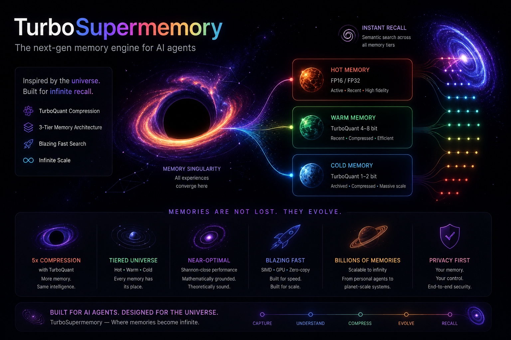

# TurboSuperMemory

[](https://www.rust-lang.org/)
[](https://www.python.org/)
[](#license)
[](#validation)

**TurboSuperMemory (TSM)** is a high-performance AI memory engine written in Rust with Python bindings. It treats memory as a persistent, tiered intelligence layer for AI agents — not just a vector store. TSM combines an HNSW vector index with hierarchical storage tiering, quantization, and a **cognitive retrieval graph** (spreading activation, reinforcement, belief revision, self-organizing importance) behind a single embeddable API.

> A memory engine differs from a vector database: a database stores everything; a memory *remembers what matters, forgets what doesn't, revises beliefs when corrected, and surfaces the most current understanding.* TSM's cognitive layer is the differentiator.

---

## Highlights

- **Fast ingest, low-latency search** — batched inserts at ~0.08 ms/item and ~4.2 ms/query at 100k × 768-dim (see [Benchmarks](#benchmarks)).
- **Hierarchical storage tiering** — Hot (RAM, FP32 HNSW), Warm (mmap, 8-bit scalar-quantized), and Cold (mmap, 8-bit scalar-quantized) tiers with automatic demotion and background consolidation.
- **Quantize-and-rerank** — quantized tiers shortlist candidates, then rerank against full-precision vectors to recover accuracy. FWHT preconditioning + Lloyd-Max / TurboQuant compress aged vectors.
- **Cognitive retrieval** — HNSW seeds fused with BM25 lexical triggers, episodic-semantic graph spreading activation, and Feeling-of-Knowing (FOK) gating. The graph **learns**: edges strengthen on retrieval and decay over time.
- **Memory evolution** — newer memories that refine or contradict older ones are linked (`Refines` / `Contradicts` edges) so the most current belief surfaces, while history is preserved. Automatic importance scoring makes memory self-organizing.
- **Durable and deterministic** — records, graph, and Compressed Cognitive State persist via a WAL + `redb` snapshot; reloads reproduce identical rankings.
- **Embeddable + networked** — Python `MemoryEngine`, plus gRPC and REST servers.

---

## What the Cognitive Layer Does

These are the features that make TSM a *memory engine* rather than a vector DB with a graph on top. All are opt-in and off by default.

| Feature | What it does |
|---|---|
| **Concept extraction** | Auto-derives concept tags from record text (stopword filtering + TF ranking) so the graph works turnkey — callers don't have to supply concepts. |
| **Learnable edges** | Edge weights derive from memory importance and are strengthened by retrieval (rehearsal) and decayed over time. Retrieval itself is the learning signal. |
| **Abstraction hierarchy** | Frequently co-occurring concepts ("rust" + "safety") spawn a parent node so a query hitting one reaches memories of the sibling. |
| **Refinement (belief update)** | A newer memory about the same topic (high text overlap) links to the older one; activation propagates so the current version surfaces. |
| **Contradiction detection (belief revision)** | A newer memory that *opposes* an older one (same topic, low text overlap) creates a `Contradicts` edge and weakens the discredited memory — without deleting history. |
| **Automatic importance scoring** | Retrieval patterns + connectivity auto-raise what matters and decay what doesn't. No manual importance tagging required. |
| **Graph introspection API** | `graph_stats()`, `get_concepts()`, `get_memory_concepts()`, `get_refinements()`, `get_contradictions()` for debugging and "what does the AI know" views. |
| **Pluggable CCS compressor** | The Compressed Cognitive State ships with a deterministic compressor; an LLM-based compressor can be swapped in at runtime. |

The cognitive benchmark proves the layer improves retrieval over plain ANN in **4/4 scenarios** (abstraction traversal, refinement surfacing, reinforcement boosting, contradiction surfacing).

---

## Benchmarks

Measured on a single machine across collection sizes of 50k and 100k vectors at 768 and 1024 dimensions, running 100 top-5 queries per run. Recall@5 is computed against an exact flat NumPy search (ground truth).

**Head-to-head (N=100,000, 768-dim):**

| System | Ingest / item | Search / query | Recall@5 | Notes |
|---|--:|--:|--:|---|
| Flat NumPy (ground truth) | 0.001 ms | 136.09 ms | 100.0% | Exact brute-force baseline |
| **TurboSuperMemory** | **0.081 ms** | **4.22 ms** | **85.2%** | Tiered + quantized, post-consolidation |
| ChromaDB (ephemeral) | 7.21 ms | 3.03 ms | 65.2% | In-process |
| Qdrant (in-memory) | 0.14 ms | 458.52 ms | 100.0% | In-process, full-precision |
| LLM-in-the-loop (Mem0) | 150.60 ms | 150.75 ms | 100.0% | 150 ms simulated LLM latency |

**Reading the numbers.** TurboSuperMemory has the fastest ingest in the field and the fastest approximate search, while holding recall in the low-to-mid 80s. Qdrant reaches perfect recall by keeping every vector at full precision in RAM, at the cost of ~100× higher query latency at this scale. Chroma is comparable on search latency but trails on both ingest speed and recall. The flat NumPy baseline is exact but scans every vector per query, so its latency grows linearly with collection size.

### Scaling across size and dimension

TurboSuperMemory across all four runs (post-consolidation, `ef=200`):

| N | Dim | Ingest / item | Search / query | Recall@5 | Peak RSS | Disk |
|--:|--:|--:|--:|--:|--:|--:|
| 50,000 | 768 | 0.082 ms | 4.82 ms | 82.2% | 1,581 MB | 435 MB |
| 50,000 | 1024 | 0.106 ms | 5.34 ms | 76.4% | 1,979 MB | 531 MB |
| 100,000 | 768 | 0.081 ms | 4.22 ms | 85.2% | 2,942 MB | 875 MB |
| 100,000 | 1024 | 0.073 ms | 6.59 ms | 76.8% | 3,266 MB | 1,068 MB |

Disk footprint includes vectors, quantized segments, graph, and the transactional WAL. Search latency stays in the 4–7 ms range as the collection grows from 50k to 100k, since per-segment HNSW work is bounded rather than linear in collection size.

### Methodology

- **Hardware:** AMD Ryzen 7 6800H (16 logical cores), 15.3 GB RAM, Windows 11.
- **Data:** 64 clusters of unit-norm vectors with 0.15 intra-cluster jitter — a realistic stand-in for embedding distributions, which live on a low-dimensional manifold with local structure. Queries are perturbed cluster members.
- **TSM config:** `ef=200`, HNSW `M=16`, `ef_construction=100`; auto-consolidation disabled and triggered once after ingest so search runs against the steady-state tiered layout. One-shot consolidation at these sizes takes ~2–4 minutes.
- **Caveats:** Single seeded run on synthetic data; Chroma and Qdrant run in their in-process modes (not as production servers). Numbers are directional, not a formal head-to-head. Reproduce with the command below.

```bash
python benchmark.py --num-items 100000 --num-queries 100 --dimension 768 \
    --data-distribution clustered --num-clusters 64 --trigger-consolidation --ef 200
```

> Note on adversarial data: pure random Gaussian unit vectors in high dimensions are near-orthogonal (pairwise cosine ≈ 1/√dim), so the true top-k is separated from the rest by noise-level gaps. That regime is pathological for *every* ANN and quantization scheme and does not reflect real embeddings. Use `--data-distribution random` to stress-test it.

---

## Architecture



Memory flows through tiers as it ages and access patterns shift:

| Tier | Location | Representation | Role |
|---|---|---|---|
| **Hot** | RAM | FP32, exact scan / HNSW | Newest records, highest fidelity |
| **Warm** | mmap | 8-bit scalar quant | Aged records, shortlist + rerank |
| **Cold** | mmap | 8-bit scalar quant | Coldest records, compact long-term store |

A background consolidation worker seals Hot segments, builds HNSW indices once a segment crosses `hnsw_threshold`, and demotes/compacts data downward under a resource budget. All quantized tiers rerank candidates against full-precision vectors before returning results.

---

## How It Works

**Preconditioning (FWHT).** A Fast Walsh-Hadamard Transform rotates the vector space to spread coordinate variance uniformly, which makes scalar quantization far more accurate.

**Quantization.** Lloyd-Max optimal centroids (1–4 bits), scalar quantization, and TurboQuant compress aged vectors. Search runs over compact codes via lookup tables, then reranks survivors with full-precision vectors.

**HNSW retrieval.** Sub-linear approximate nearest-neighbor search over the Hot/Sealed tiers, built multi-threaded (256-point single-threaded seed + parallel insert). An exact-scan fallback for small collections (≤ 4,096 records) guarantees deterministic results.

**Cognitive graph.** Memories and concepts form a property graph. Retrieval fuses dense semantic seeds with BM25 lexical triggers and propagates activation through the graph with lateral inhibition. Score fusion blends cosine similarity with graph activation so reinforcement, refinement, and abstraction can re-rank memories above pure vector distance.

**Memory evolution.** On consolidation, the engine detects refinements (same topic, updated content → `Refines` edge) and contradictions (same topic, opposing content → `Contradicts` edge + weakened old memory), and rescores importance from retrieval patterns. The newer belief surfaces; history is never deleted.

**FOK gating.** Retrievals whose peak activation falls below a configurable threshold are rejected, keeping irrelevant context out of the agent's window.

**Compressed Cognitive State (CCS).** A bounded, schema-governed working-memory state updated each turn. Ships with a deterministic stub; an LLM-based compressor can be plugged in via a trait.

---

## Quickstart (Python)

```python
import numpy as np
import turbomemory

engine = turbomemory.MemoryEngine(
    db_path="./test_db",
    dimension=768,
    max_edges=16,
    search_list_size=100,
    outlier_count=0,
    auto_consolidation_secs=60,  # 0 disables the background worker
    # Cognitive-layer knobs (all opt-in, off by default):
    importance_auto_scoring=True,       # self-organizing memory importance
    refinement_cosine_threshold=0.85,   # link newer memories that refine older ones
    contradiction_cosine_threshold=0.75,# detect + weaken contradicted beliefs
    cognitive_alpha=0.5,                # blend cosine with graph activation
)

engine.insert(
    id="mem_1",
    text="Rust is known for memory safety, concurrency, and speed.",
    embedding=np.random.randn(768).astype(np.float32),
    importance_score=1.0,
    concepts=["rust", "concurrency", "safety"],
)

# Approximate vector search; the third arg is ef (higher = more recall, more latency).
hits = engine.search_ann(np.random.randn(768).astype(np.float32), top_k=5, search_list_size=200)

# Cognitive search fuses vector seeds with lexical + graph signals.
results = engine.search(
    query_text="Rust safety speed",
    query_embedding=np.random.randn(768).astype(np.float32),
    top_k=5,
)

# Inspect what the engine has learned.
print(engine.graph_stats())           # (nodes, edges, memories, concepts, ...)
print(engine.get_concepts())          # [(concept, degree), ...] sorted by degree
print(engine.get_memory_concepts("mem_1"))

engine.trigger_consolidation()        # seals tiers + runs cognitive maintenance
engine.flush()
engine.close()
```

For high-throughput ingest, use `insert_batch(ids, texts, embeddings, scores, concepts)` to amortize the Python↔Rust boundary.

---

## Developer Guide

### Prerequisites

- Stable Rust 1.96+
- Python 3.12 with development libraries. Set `PYO3_PYTHON` if Python isn't on the default path:
  ```powershell
  $env:PYO3_PYTHON = "C:\Users\User\AppData\Local\Programs\Python\Python312\python.exe"
  ```

### Common tasks

```bash
make test            # cargo test --workspace
make build-python    # produces target/release/turbomemory.dll
make verify          # end-to-end integration checks
make audit           # recall + restart-correctness audit
make benchmark       # performance suite
make build-api       # builds the gRPC + REST server binary
```

`build-python` emits `target/release/turbomemory.dll`; the verification and benchmark scripts copy it to `turbomemory.pyd` for import. Only one process can hold that file at a time — run TSM Python scripts sequentially.

> **Windows build note:** linking the storage debug-test binary can exhaust `link.exe` memory (`LNK1102`). Strip debug info for the test run as a workaround: `CARGO_PROFILE_DEV_DEBUG=0 CARGO_PROFILE_TEST_DEBUG=0 cargo test ...`. Release builds are unaffected.

---

## <a name="validation"></a>Validation

The full verification matrix passes on the current `main`:

| Check | Result |
|---|---|
| `cargo fmt --all --check` | clean |
| `cargo clippy --workspace --all-targets -- -D warnings` | clean |
| `cargo test --workspace --exclude turbomemory_python` | **144 passed / 0 failed** |
| `python verify.py` (E2E) | all pass |
| `python cognitive_benchmark.py` | **4/4 cognitive scenarios won** |

Test breakdown: core 29 · graph 49 · storage 63 · crash-recovery 3.

---

## Repository Structure

```text
├── ResearchPapers/           # Reference arXiv papers
├── assets/img_2.png          # Architecture diagram
├── crates/
│   ├── turbomemory_core/      # Vector math, FWHT, Lloyd-Max, quantization, LUT search
│   ├── turbomemory_storage/   # Tiered StorageEngine, mmap segments, WAL, consolidation
│   ├── turbomemory_graph/     # BM25, spreading activation, FOK gate, CCS, memory evolution
│   ├── turbomemory_python/    # PyO3 MemoryEngine bindings
│   └── turbomemory_api/       # gRPC (tonic) + REST (axum) servers
├── verify.py                 # E2E integration tests
├── audit_recall.py           # Recall + restart-correctness audit
├── benchmark.py              # Performance benchmarking harness
├── cognitive_benchmark.py    # Cognitive-layer retrieval scenarios
├── Makefile
└── Cargo.toml                # Workspace manifest
```

---

## Research Foundations

Builds on HNSW (Malkov & Yashunin 2016), DiskANN/FreshDiskANN, ScaNN, TurboQuant, QJL, and memory-systems work (Mem0, MAGMA, A-Mem, MemOS, HiMem, MemGPT). It borrows production patterns from **Qdrant** (segmented mmap, WAL, optimize/flush workers), **mem0** (provider adapters, entity linking), and **Chroma** (WAL-as-source-of-truth, separate vector/metadata segments).

---

## Roadmap

TSM tracks a detailed engineering roadmap in [`TODO.md`](./TODO.md). The near-term focus is deepening the cognitive layer (the differentiator) before scaling the architecture to 1M+ vectors.

- ✅ **Core engine** — durable storage, HNSW + exact fallback, tiered Hot/Warm/Cold segments, quantization, cognitive graph, CCS.
- ✅ **Cognitive layer** — concept extraction, learnable edges, reinforcement/decay, abstraction hierarchy, refinement, contradiction detection, automatic importance scoring, graph introspection API.
- ✅ **Production patterns** — lock-free segment snapshots, parallel multi-segment search, multi-threaded HNSW build, zero-copy numpy ingest, bounded eviction + semantic dedup.
- 🔜 **Cognitive deepening** — real-embedding benchmark, online concept-vocabulary evolution, per-agent memory scoping, streaming/n-gram concept extraction.
- 🔜 **Scaling to 1M × 4k** — sharding, paged metadata store, rotating WAL, vacuum optimizer.
- 🔜 **Operations** — tracing, metrics, auth/CORS, Docker, cross-platform builds.

---

## License

Licensed under the **MIT License** — see [LICENSE](./LICENSE).

Copyright © 2026 jatin711-debug.
