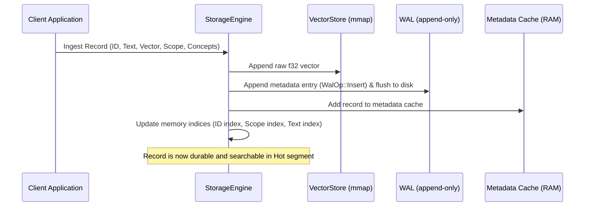
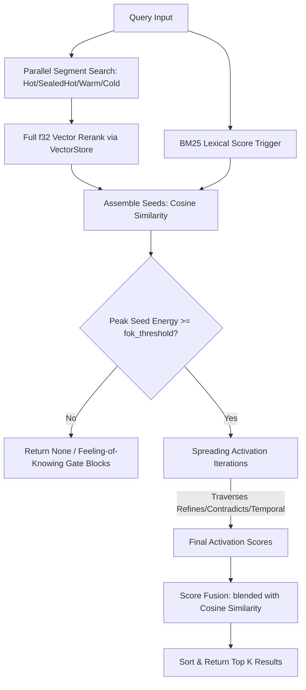

# TurboSuperMemory — Unified Architecture Documentation

Welcome to the architectural documentation for **TurboSuperMemory**, a high-performance, production-oriented AI Memory Engine written in Rust with PyO3 Python bindings. 

Unlike standard vector databases which focus solely on dense index retrieval (e.g. HNSW, IVF), TurboSuperMemory treats memory as a **first-class persistent cognitive layer** for AI agents. It models memory using a tiered vector storage system and an episodic-semantic graph with spreading activation.

---

## 1. System Crate Overview

The codebase is organized as a Cargo workspace split into five specialized crates.

```mermaid
graph TD
    api[turbomemory_api - gRPC/REST Service] --> storage[turbomemory_storage - Segment & Persistence Engine]
    python[turbomemory_python - PyO3 Bindings] --> storage
    storage --> graph[turbomemory_graph - Cognitive Reasoner & BM25]
    storage --> core[turbomemory_core - SIMD Math & Quantization]
    graph --> core
```

* [**`turbomemory_core`**](file:///d:/personal-projects/TurboSuperMemory/docs/core_quantization.md): SIMD math kernels (AVX2/NEON), Fast Walsh-Hadamard Transform (FWHT) preconditioning, Lloyd-Max centroids, and quantization encoders (Scalar, Sign, TurboQuant).
* [**`turbomemory_storage`**](file:///d:/personal-projects/TurboSuperMemory/docs/storage_persistence.md): Mmap-backed dense vector storage, Write-Ahead Log (WAL) append-only durability, `redb` snapshot persistence, multi-agent scoping (`ScopeIndex`), metadata tables, and the segment consolidation engine.
* [**`turbomemory_graph`**](file:///d:/personal-projects/TurboSuperMemory/docs/cognitive_graph.md): The episodic-semantic memory graph, BM25 indexing, spreading activation scoring, Working Memory compression (CCS), synonym vocabulary evolution, and automatic importance recomputation.
* [**`turbomemory_python`**](file:///d:/personal-projects/TurboSuperMemory/docs/bindings_api.md): High-performance PyO3 bindings exposing the memory engine as a Python package, including zero-copy NumPy array mappings and GIL-free concurrency.
* [**`turbomemory_api`**](file:///d:/personal-projects/TurboSuperMemory/docs/bindings_api.md): Multi-protocol service providing REST (Axum) and gRPC (Tonic) frontends over a unified memory service.

---

## 2. Core Architectural Decisions

### 2.1 Why Rust?
Memory engines for AI agents are highly CPU-bound (due to dense vector math and graph traversals) and memory-bound. Rust provides absolute control over memory allocation, SIMD vector instructions, and lock-free data structures, while providing complete safety from segmentation faults.

### 2.2 Why Segmented Tiers?
Standard vector databases rebuild large monolithic indices, which can create high write latencies. TurboSuperMemory splits storage into four distinct tiers:
1. **Hot**: Appendable in-memory buffers (fast writes, brute-force exact scan).
2. **SealedHot**: Indexed HNSW files built asynchronously in the background.
3. **Warm**: 8-bit quantized vectors (4x memory reduction) scanned via SIMD.
4. **Cold**: 1-bit sign-quantized vectors (32x memory reduction) scanned via fast bitwise XOR/popcount lookup tables.
This keeps write latency low while optimizing search speeds for old/cold memories.

### 2.3 The Split-Persistence Model (WAL + redb)
To achieve durability without duplicating large vector data:
* Vector float arrays are written directly to the mmap'd `vectors.bin` file.
* Metadata and record attributes are appended immediately to a lightweight Write-Ahead Log (`wal_meta.bin`).
* A snapshot is written lazily to `redb` (`memory.redb`) during background consolidation.
* On crash/reboot, the engine replays the lightweight WAL over the last `redb` snapshot.

---

## 3. System Dataflow

### 3.1 Write Path (Ingestion)


### 3.2 Read Path (Cognitive Retrieval)


---

## 4. Subsystem Documentation Links

For in-depth explanations of specific features, browse the detailed sub-documents:

1. [**Core Math, SIMD, and Quantization Subsystem**](file:///d:/personal-projects/TurboSuperMemory/docs/core_quantization.md)
   * Hard-level SIMD routines (AVX2/NEON), preconditioning approximate rotations, Lloyd-Max tables, and TurboQuant MSE/Prod quantizers.
2. [**Storage, Durability, and Segment Tiers Subsystem**](file:///d:/personal-projects/TurboSuperMemory/docs/storage_persistence.md)
   * The Write-Ahead Log (WAL) durability, `redb` lazy snapshot persistence, segmented search execution, background optimization, and thread-safe concurrency.
3. [**Cognitive Memory Graph Subsystem**](file:///d:/personal-projects/TurboSuperMemory/docs/cognitive_graph.md)
   * Episodic-semantic graph nodes/edges, Spreading Activation, Feeling-of-Knowing (FOK) gating, pluggable CCS working memory compaction, synonym vocabulary evolution, and automatic importance scoring.
4. [**Python Bindings and API Services Subsystem**](file:///d:/personal-projects/TurboSuperMemory/docs/bindings_api.md)
   * PyO3 binding structures, zero-copy NumPy array operations, thread GIL releases, Tonic gRPC, and Axum REST controllers.

---

## 5. Roadmap and Development Status

The development of TurboSuperMemory follows a structured progression outlined in [TODO.md](file:///d:/personal-projects/TurboSuperMemory/TODO.md):

* **Stage 1: Cognitive Deepening (Completed 2026-06-21)**
  * [x] **C1: Contradiction Detection** (Belief revision, weakening outdated records).
  * [x] **C2: Automatic Importance Scoring** (Salience-based moving averages, edge weight re-scaling).
  * [x] **C3: Online Concept Vocabulary Evolution** (Alias co-occurrence merging, hub suppression).
  * [x] **C4: Per-Agent Memory Scoping** (Bitmap-based multi-tenant namespace isolation).
  * [x] **C5: Real-Embedding Cognitive Scale Benchmark** (768-dim clustered GMM testing with 1000+ distractors).
  * [x] **C6: Pluggable LLM Working Memory Compressor** (Bridge PyO3 custom callbacks).
  * [x] **C7: Graph Introspection API** (Stats, concept degrees, refinements, contradictions).
  * [x] **C8: Automated Concept Extraction** (TF ranking, length bonuses, alias mapping).
* **Stage 2: Structural Scaling (In Progress / Next)**
  * [ ] **S1: Collection Sharding** (Distribute partitions).
  * [ ] **S2: Asynchronous index builds** (Improve SealedHot build performance).
  * [ ] **S3: Memory-mapped indices** (Scale storage bounds).
