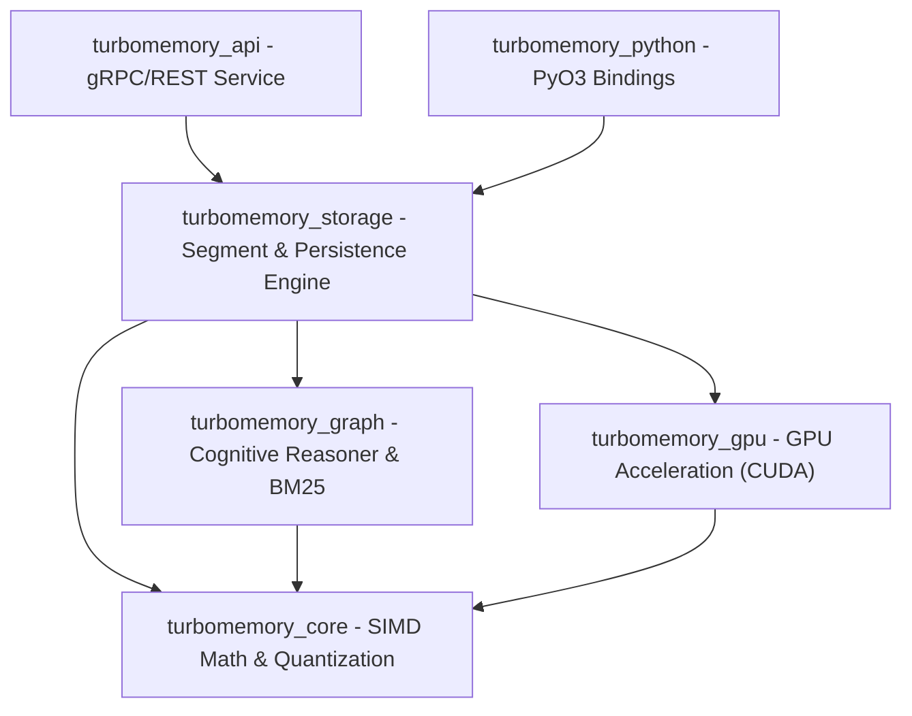
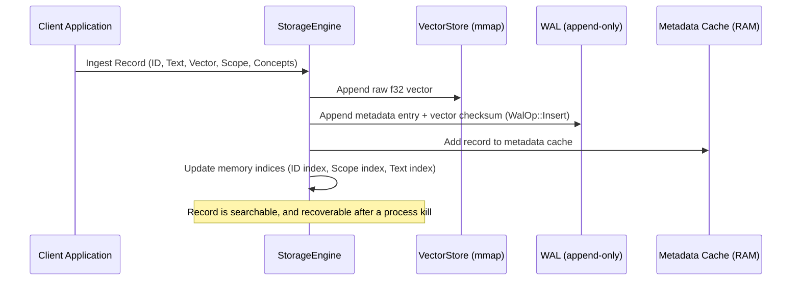
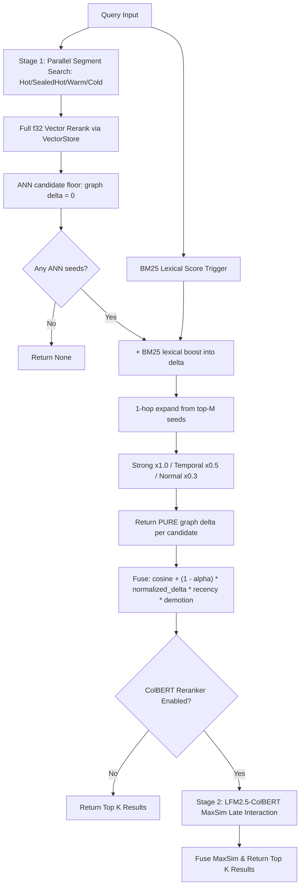
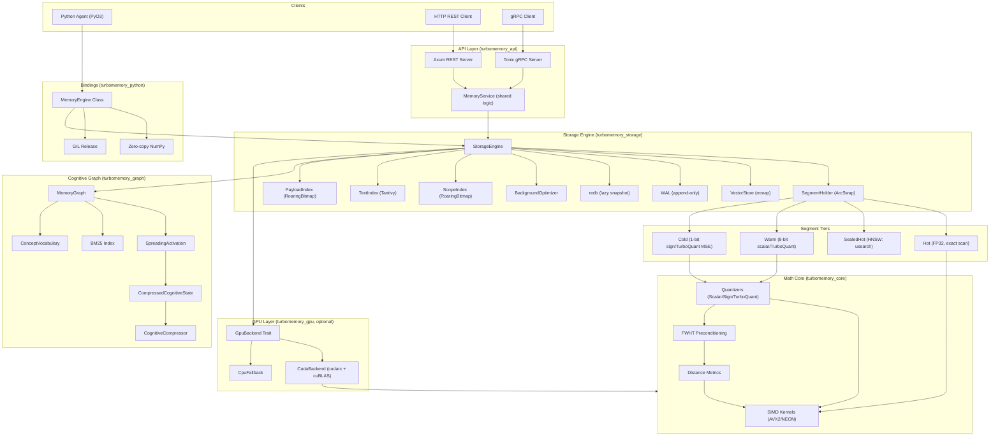
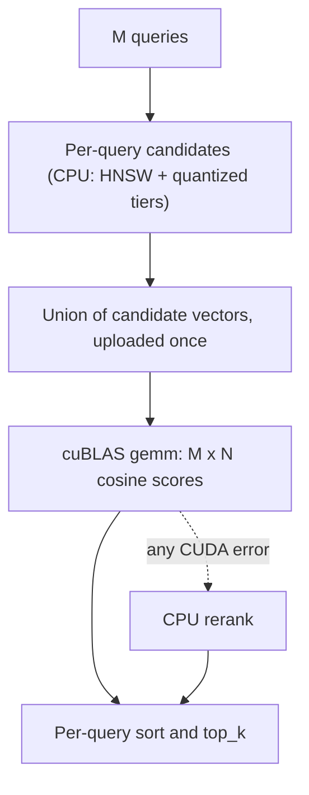

# TurboSuperMemory — Unified Architecture Documentation

Welcome to the architectural documentation for **TurboSuperMemory**, a high-performance, production-oriented AI Memory Engine written in Rust with PyO3 Python bindings. 

Unlike standard vector databases which focus solely on dense index retrieval (e.g. HNSW, IVF), TurboSuperMemory treats memory as a **first-class persistent cognitive layer** for AI agents. It models memory using a tiered vector storage system and an episodic-semantic graph with spreading activation.

---

## 1. System Crate Overview

The codebase is organized as a Cargo workspace split into five specialized crates.

```mermaid
graph TD
    api["turbomemory_api - gRPC/REST Service"] --> storage["turbomemory_storage - Segment & Persistence Engine"]
    python["turbomemory_python - PyO3 Bindings"] --> storage
    storage --> graph_crate["turbomemory_graph - Cognitive Reasoner & BM25"]
    storage --> core["turbomemory_core - SIMD Math & Quantization"]
    storage --> gpu["turbomemory_gpu - GPU Acceleration (CUDA)"]
    graph_crate --> core
    gpu --> core
```

* [**`turbomemory_core`**](file:///d:/personal-projects/TurboSuperMemory/docs/core_quantization.md): SIMD math kernels (AVX2/NEON), Fast Walsh-Hadamard Transform (FWHT) preconditioning, Lloyd-Max centroids, and quantization encoders (Scalar, Sign, TurboQuant).
* [**`turbomemory_storage`**](file:///d:/personal-projects/TurboSuperMemory/docs/storage_persistence.md): Mmap-backed dense vector storage, Write-Ahead Log (WAL) append-only durability, `redb` snapshot persistence, multi-agent scoping (`ScopeIndex`), metadata tables, and the segment consolidation engine.
* [**`turbomemory_graph`**](file:///d:/personal-projects/TurboSuperMemory/docs/cognitive_graph.md): The episodic-semantic memory graph, BM25 indexing, the bounded cognitive augmenter (single 1-hop graph-delta re-rank), Working Memory compression (CCS), synonym vocabulary evolution, and automatic importance recomputation.
* [**`turbomemory_python`**](file:///d:/personal-projects/TurboSuperMemory/docs/bindings_api.md): High-performance PyO3 bindings exposing the memory engine as a Python package, including zero-copy NumPy array mappings and GIL-free concurrency.
* [**`turbomemory_api`**](file:///d:/personal-projects/TurboSuperMemory/docs/bindings_api.md): Multi-protocol service providing REST (Axum) and gRPC (Tonic) frontends over a unified memory service.
* [**`turbomemory_gpu`**](file:///d:/personal-projects/TurboSuperMemory/docs/gpu_acceleration.md): Optional GPU acceleration layer with a trait-based backend system (`GpuBackend`), CUDA implementation via `cudarc` (exact search over device-resident vectors, and a cuBLAS batched rerank as its fallback), and transparent CPU fallback.

---

## 2. Core Architectural Decisions

### 2.1 Why Rust?
Memory engines for AI agents are highly CPU-bound (due to dense vector math and graph traversals) and memory-bound. Rust provides absolute control over memory allocation, SIMD vector instructions, and lock-free data structures, while providing complete safety from segmentation faults.

### 2.2 Why Segmented Tiers & Swappable Quantization?
Standard vector databases rebuild large monolithic indices, which can create high write latencies. TurboSuperMemory splits storage into four distinct tiers:
1. **Hot**: Appendable in-memory buffers (fast writes, brute-force exact scan).
2. **SealedHot**: Indexed HNSW files built asynchronously in the background (on the CPU, with `usearch`).
3. **Warm**: 8-bit scalar quantized vectors (4x memory reduction) or 2-bit RaBitQ scanned via SIMD.
4. **Cold**: 1-bit **RaBitQ** (Randomized Binary Quantization, 30.7x memory reduction) or TurboQuant MSE vectors scanned via fast bitwise XOR/popcount lookup tables.
* **Universal Dimension Support**: Unlike TurboQuant (which requires strict power-of-two dimensions $2^k$), **RaBitQ** natively supports standard 384-d (MiniLM), 768-d (MPNet, Nomic), and 1536-d (OpenAI) embeddings with guaranteed $O(1/d)$ theoretical MSE distortion bounds.
This keeps write latency low while optimizing search speeds for old/cold memories. With the optional `turbomemory_gpu` crate and a CUDA device, the vector search itself moves to the GPU for stores that fit in device memory; see [GPU acceleration](gpu_acceleration.md).

### 2.3 Adaptive Prompt Budget Saliency (Submodular MMR)
For agent prompt generation under tight token limits (150, 300, 1000+ tokens):
* **Adaptive Saliency Cap (`max_items = min(10, max(4, token_budget // 35))`): Prevents "context-stuffing" noise pollution when large token budgets are provided.
* **Semantic Redundancy Gate (`red > 0.72`)**: Rejects near-duplicate rephrasings of the same event to guarantee cross-session diversity.
* **Cross-Turn Coverage Bonus (`+0.20`)**: Rewards facts from distinct temporal sessions to excel at multi-session reasoning.

### 2.4 The Split-Persistence Model (WAL + redb)
To achieve durability without duplicating large vector data:
* Vector float arrays are written directly to the mmap'd `vectors.bin` file.
* Metadata and record attributes are appended immediately to a lightweight Write-Ahead Log (`wal_meta.bin`).
* A snapshot is written lazily to `redb` (`memory.redb`) during background consolidation.
* On open, the engine replays the lightweight WAL over the last `redb` snapshot. Each WAL insert carries a checksum of its vector, and replay reads the vector straight from its slot in `vectors.bin`, so a process that is killed loses nothing it acknowledged. (The WAL is fsynced on `flush()`, not per write: after a power loss, writes since the last flush may be missing; they are never half-applied.)
* Index segments are derived data. A segment that cannot be loaded is discarded on open and its records are indexed again.

### 2.5 GPU Acceleration Strategy
GPU acceleration is **optional**:
* **Trait-based design**: `GpuBackend` allows other GPU APIs later (CUDA today).
* **Silent fallback**: every GPU operation falls back to the CPU on error.
* **Exact search on resident vectors**: with the `cuda` feature, a store above 4,096 records is searched by one cuBLAS product over a copy of its vectors kept in device memory (single queries and batches alike; concurrent queries share a call). If the store does not fit the device memory budget the engine uses the CPU path, where the full-f32 rerank of `search_ann_batch` runs as a single cuBLAS `gemm`. Index construction, index search and the quantized scans stay on the CPU.
* **Opt-in compilation**: the `cuda` feature must be explicitly enabled; default builds are CPU-only.

On the one GPU it has been measured on (RTX 3050 Laptop, 4 GB), resident search is 4–7× faster than the CPU path for a single query and 8–45× per query in a batch, at stores of 20,000 to 100,000 vectors; see [GPU acceleration](gpu_acceleration.md) for the numbers and their limits.

---

## 3. System Dataflow

### 3.1 Write Path (Ingestion)

```mermaid
sequenceDiagram
    participant App as Client Application
    participant Core as StorageEngine
    participant VS as VectorStore (mmap)
    participant WAL as WAL (append-only)
    participant Cache as Metadata Cache (RAM)
    
    App->>Core: Ingest Record (ID, Text, Vector, Scope, Concepts)
    Core->>VS: Append raw f32 vector
    Core->>WAL: Append metadata entry + vector checksum (WalOp::Insert)
    Core->>Cache: Add record to metadata cache
    Core->>Core: Update memory indices (ID index, Scope index, Text index)
    Note over Core: Record is searchable, and recoverable after a process kill
```

### 3.2 Read Path (Cognitive Retrieval & 2-Stage Late Interaction)

Retrieval in TurboSuperMemory follows a **2-Stage Hybrid Retrieval Pipeline**:

1. **Stage 1 (TSM Core Fast Candidate Scan & Graph Expansion)**:
   - Evaluates parallel segment candidate pools across Hot (RAM), Warm (TurboQuant-Prod), and Cold (TurboQuant-MSE) tiers in $<1\text{ms}$.
   - Reranks candidates against the full float32 vector store (`vectors.bin`).
   - Fuses semantic cosine similarity with 1-hop spreading activation across concept nodes and ACT-R power-law recency decay:
     $$\text{Score}_{\text{TSM}}(M) = \Big[ \text{Cosine}(Q, M) + (1 - \alpha) \cdot \sigma(\Delta_{\text{graph}}(M)) \Big] \cdot \Big(1 + \lambda_{\text{recency}} \cdot \frac{\text{seq}(M)}{\text{seq}_{\max}}\Big) \cdot D(M)$$

2. **Stage 2 (Optional ColBERT Multi-Vector Late Interaction)**:
   - For multi-constraint and rare-entity queries, Stage 1 passes an expanded shortlist ($K_1 = 3 \times \text{top\_k}$) to the token-level multi-vector encoder (`LiquidAI/LFM2.5-ColBERT-350M` on CUDA).
   - Computes token-level MaxSim dot products:
     $$\text{MaxSim}(Q, D) = \sum_{i=1}^{L_q} \max_{j=1}^{L_d} (Q_i \cdot D_j)$$
   - Fuses the scores to rank the most relevant memories at the top:
     $$\text{Score}_{\text{fused}}(M) = \text{Score}_{\text{TSM}}(M) \cdot \Big(1 + \text{Softmax}(\text{MaxSim}(Q, M)) \cdot N\Big)$$

```mermaid
flowchart TD
    Q["Query Input"] --> ANN["Stage 1: Parallel Segment Search: Hot/SealedHot/Warm/Cold"]
    ANN --> Rerank["Full f32 Vector Rerank via VectorStore"]
    Rerank --> Floor["ANN candidate floor: graph delta = 0"]
    Q --> BM25["BM25 Lexical Score Trigger"]
    Floor --> Empty{"Any ANN seeds?"}
    Empty -- "No" --> ReturnNone["Return None"]
    Empty -- "Yes" --> Lexical["+ BM25 lexical boost into delta"]
    BM25 --> Lexical
    Lexical --> Expand["1-hop expand from top-M seeds"]
    Expand --> Pools["Strong x1.0 / Temporal x0.5 / Normal x0.3"]
    Pools --> Delta["Return PURE graph delta per candidate"]
    Delta --> Fusion["Fuse: cosine + (1 - alpha) * normalized_delta * recency * demotion"]
    Fusion --> Stage2{"ColBERT Reranker Enabled?"}
    Stage2 -- "No" --> TopK["Return Top K Results"]
    Stage2 -- "Yes" --> ColBERT["Stage 2: LFM2.5-ColBERT MaxSim Late Interaction"]
    ColBERT --> FinalSort["Fuse MaxSim & Return Top K Results"]
```

### 3.3 Full System Component Diagram

```mermaid
graph TB
    subgraph Clients["Clients"]
        PyClient["Python Agent (PyO3)"]
        RESTClient["HTTP REST Client"]
        gRPCClient["gRPC Client"]
    end
    
    subgraph API_Layer["API Layer (turbomemory_api)"]
        Axum["Axum REST Server"]
        Tonic["Tonic gRPC Server"]
        Service["MemoryService (shared logic)"]
    end
    
    subgraph Bindings["Bindings (turbomemory_python)"]
        PyEngine["MemoryEngine Class"]
        PyNumpy["Zero-copy NumPy"]
        PyGIL["GIL Release"]
    end
    
    subgraph Storage["Storage Engine (turbomemory_storage)"]
        Engine["StorageEngine"]
        Segments["SegmentHolder (ArcSwap)"]
        VectorStore["VectorStore (mmap)"]
        WAL["WAL (append-only)"]
        redb["redb (lazy snapshot)"]
        Optimizer["BackgroundOptimizer"]
        ScopeIndex["ScopeIndex (RoaringBitmap)"]
        TextIndex["TextIndex (Tantivy)"]
        PayloadIndex["PayloadIndex (RoaringBitmap)"]
    end
    
    subgraph Tiers["Segment Tiers"]
        Hot["Hot (FP32, exact scan)"]
        SealedHot["SealedHot (HNSW: usearch)"]
        Warm["Warm (8-bit scalar/TurboQuant)"]
        Cold["Cold (1-bit sign/TurboQuant MSE)"]
    end
    
    subgraph GPU["GPU Layer (turbomemory_gpu, optional)"]
        GpuBackend["GpuBackend Trait"]
        CudaBackend["CudaBackend (cudarc + cuBLAS)"]
        CpuFallback["CpuFallback"]
    end
    
    subgraph Graph["Cognitive Graph (turbomemory_graph)"]
        MemoryGraph["MemoryGraph"]
        Spreading["SpreadingActivation"]
        BM25["BM25 Index"]
        CCS["CompressedCognitiveState"]
        Compressor["CognitiveCompressor"]
        Vocab["ConceptVocabulary"]
    end
    
    subgraph Core["Math Core (turbomemory_core)"]
        SIMD["SIMD Kernels (AVX2/NEON)"]
        FWHT["FWHT Preconditioning"]
        Quantizers["Quantizers (Scalar/Sign/TurboQuant)"]
        Metrics["Distance Metrics"]
    end
    
    PyClient --> PyEngine
    RESTClient --> Axum
    gRPCClient --> Tonic
    Axum --> Service
    Tonic --> Service
    Service --> Engine
    PyEngine --> PyNumpy
    PyEngine --> PyGIL
    PyEngine --> Engine
    
    Engine --> Segments
    Engine --> VectorStore
    Engine --> WAL
    Engine --> redb
    Engine --> Optimizer
    Engine --> ScopeIndex
    Engine --> TextIndex
    Engine --> PayloadIndex
    Engine --> MemoryGraph
    Engine --> GpuBackend
    
    Segments --> Hot
    Segments --> SealedHot
    Segments --> Warm
    Segments --> Cold
    
    Hot --> SIMD
    Warm --> Quantizers
    Cold --> Quantizers
    
    GpuBackend --> CudaBackend
    GpuBackend --> CpuFallback
    CudaBackend --> Core
    
    MemoryGraph --> Spreading
    MemoryGraph --> BM25
    MemoryGraph --> Vocab
    Spreading --> CCS
    CCS --> Compressor
    
    Quantizers --> SIMD
    Quantizers --> FWHT
    Metrics --> SIMD
    FWHT --> Metrics
```

### 3.4 GPU-Accelerated Search Path (Opt-in via `cuda` feature)

When the `cuda` feature is enabled, a CUDA device is available, and the store does not fit the device memory budget, `search_ann_batch` reranks the candidates of all its queries in one cuBLAS `gemm`:

```mermaid
flowchart TD
    Q["M queries"] --> Cand["Per-query candidates (CPU: HNSW + quantized tiers)"]
    Cand --> Union["Union of candidate vectors, uploaded once"]
    Union --> Gemm["cuBLAS gemm: M x N cosine scores"]
    Gemm --> Top["Per-query sort and top_k"]
    Gemm -. "any CUDA error" .-> Cpu["CPU rerank"]
    Cpu --> Top
```

That is the fallback. When the store's vectors fit in device memory they stay there, and both single-query and batch search skip the segment search entirely: one product over every resident row, then a host-side pick of the best live, permitted rows (`gpu_exact.rs`).

---

## 4. Subsystem Documentation Links

For in-depth explanations of specific features, browse the detailed sub-documents:

1. [**Core Math, SIMD, and Quantization Subsystem**](file:///d:/personal-projects/TurboSuperMemory/docs/core_quantization.md)
   * Hard-level SIMD routines (AVX2/NEON), preconditioning approximate rotations, Lloyd-Max tables, and TurboQuant MSE/Prod quantizers.
2. [**Storage, Durability, and Segment Tiers Subsystem**](file:///d:/personal-projects/TurboSuperMemory/docs/storage_persistence.md)
   * The Write-Ahead Log (WAL) durability, `redb` lazy snapshot persistence, segmented search execution, background optimization, and thread-safe concurrency.
3. [**Cognitive Memory Graph Subsystem**](file:///d:/personal-projects/TurboSuperMemory/docs/cognitive_graph.md)
   * Episodic-semantic graph nodes/edges, the bounded cognitive augmenter (ANN-floor + single 1-hop graph delta), pluggable CCS working memory compaction, synonym vocabulary evolution, and automatic importance scoring.
4. [**Python Bindings and API Services Subsystem**](file:///d:/personal-projects/TurboSuperMemory/docs/bindings_api.md)
   * PyO3 binding structures, zero-copy NumPy array operations, thread GIL releases, Tonic gRPC, and Axum REST controllers.
5. [**GPU Acceleration Subsystem**](file:///d:/personal-projects/TurboSuperMemory/docs/gpu_acceleration.md)
   * Trait-based GPU backend design, exact search over device-resident vectors, the batched rerank fallback, and measured results.

---

## 5. Roadmap and Development Status

The development of TurboSuperMemory follows a structured progression outlined in [TODO.md](file:///d:/personal-projects/TurboSuperMemory/TODO.md):

* **Stage 1: Cognitive Deepening (Completed 2026-06-21)**
  * [x] **C1: Contradiction Detection** (Belief revision, weakening outdated records).
  * [x] **C2: Automatic Importance Scoring** (Salience-based moving averages, edge weight re-scaling).
  * [x] **C3: Online Concept Vocabulary Evolution** (Alias co-occurrence merging, hub suppression).
  * [x] **C4: Per-Agent Memory Scoping** (Bitmap-based multi-tenant namespace isolation).
  * [x] **C5: Real-Embedding Cognitive Scale Benchmark** (768-dim clustered GMM testing with 1000+ distractors).
  * [x] **C6: Pluggable LLM Working Memory Compressor** (Bridge PyO3 custom callbacks).
  * [x] **C7: Graph Introspection API** (Stats, concept degrees, refinements, contradictions).
  * [x] **C8: Automated Concept Extraction** (TF ranking, length bonuses, alias mapping).
* **Stage 1.5: GPU Acceleration (Completed 2026-06-21)**
  * [x] **G1: GPU Backend Trait** (`GpuBackend` with `CudaBackend` + `CpuFallback`).
  * [x] **G2: cuBLAS Batched Distance** (cuBLAS `sgemv` for exact scan and rerank).
  * [x] **G3: CUDA HNSW Build** (removed 2026-10-06: the graph it built was never searched and doubled sealing time).
  * [x] **G4: GPU Integration** (Storage engine integration, Python `gpu_accelerated` property).
* **Stage 2: Structural Scaling (In Progress / Next)**
  * [ ] **S1: Collection Sharding** (Distribute partitions).
  * [ ] **S2: Asynchronous index builds** (Improve SealedHot build performance).
  * [ ] **S3: Memory-mapped indices** (Scale storage bounds).
