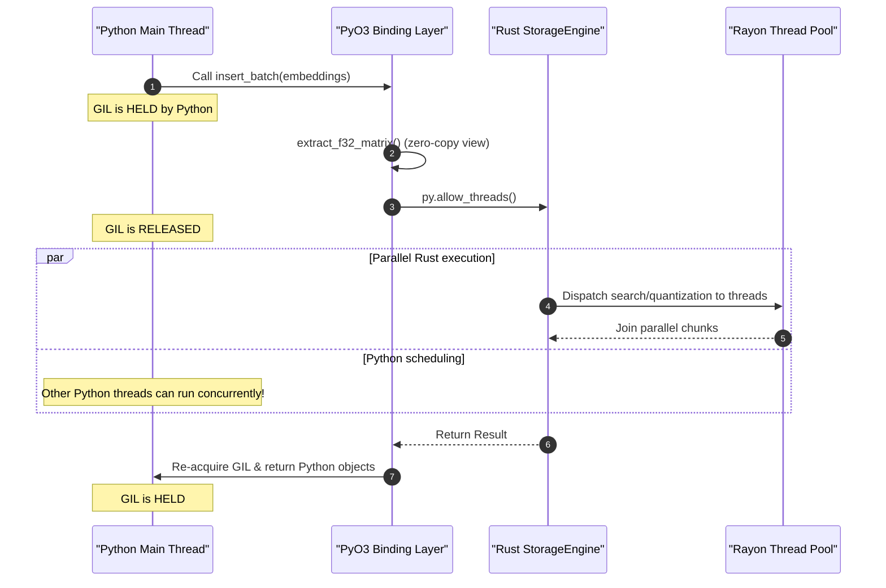
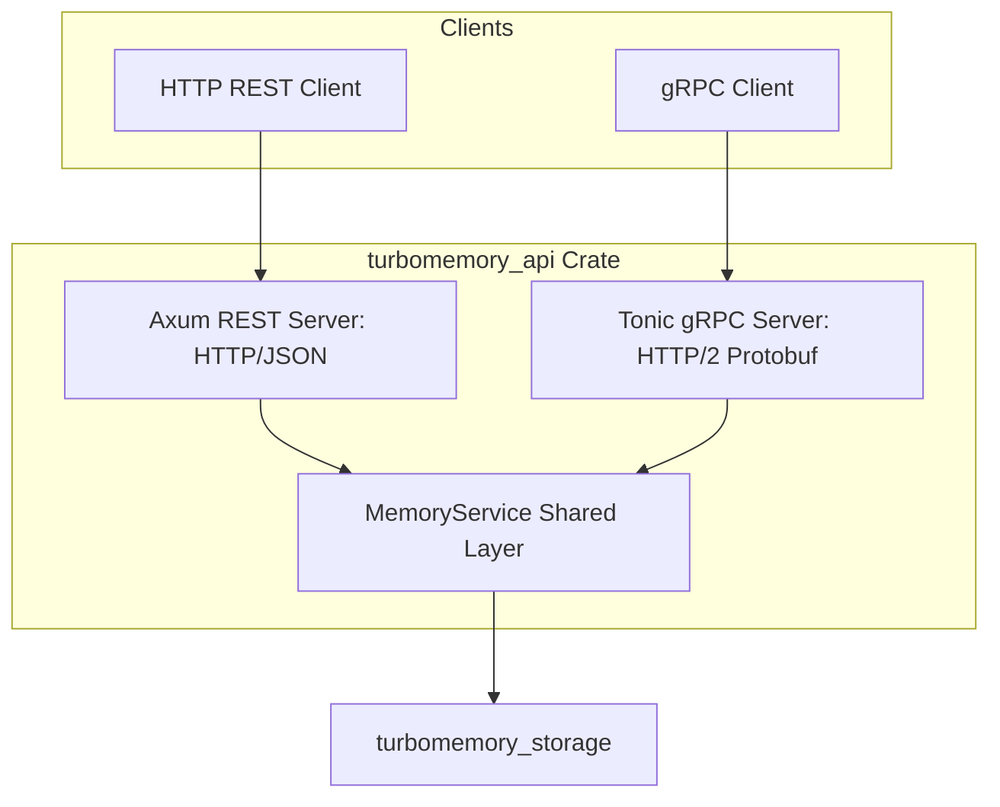

# Python Bindings and API Services Subsystem

This document explains the integration layers of TurboSuperMemory, covering the PyO3 Python bindings (located in [crates/turbomemory_python](file:///d:/personal-projects/TurboSuperMemory/crates/turbomemory_python)) and the dual gRPC/REST API servers (located in [crates/turbomemory_api](file:///d:/personal-projects/TurboSuperMemory/crates/turbomemory_api)).

---

## 1. PyO3 Python Bindings

The Python bindings expose the underlying Rust engine to Python as a fast module (`turbomemory.pyd`), allowing data scientists and agent developers to integrate high-performance cognitive storage into Python-based LLM frameworks.


### 1.1 Zero-Copy NumPy Integration
Transferring large matrices between Python and Rust can be slow if copying occurs. To avoid this, `turbomemory_python` uses the `numpy` crate to acquire direct read-only views of C-contiguous NumPy float arrays:
* **Vectors** (`PyReadonlyArray1<f32>`): Maps to a contiguous `&[f32]` slice.
* **Matrices** (`PyReadonlyArray2<f32>`): Maps to a contiguous batch slice `&[&[f32]]` by chunking the raw row buffer.
* *Fallback*: If the input is a list, tuple, or non-contiguous numpy array, it falls back to copying the data into a standard Rust `Vec<f32>`.

### 1.2 GIL Management
To ensure multi-threaded Python programs (such as Celery workers or FastAPI applications) do not freeze during intensive math tasks, Rust releases the Python Global Interpreter Lock (GIL) on all expensive operations:
```rust
py.allow_threads(|| {
    self.engine.insert_batch(&offsets, records)
})
```
This allows the Python interpreter to schedule other threads while the Rust CPU kernels run calculations (like quantization calibration, HNSW graph walks, or Rayon-based parallel scans).



### 1.3 Exception Mapping
Crate-level `StorageError` variants are mapped to standard Python exception types:
* `DuplicateId`, `DimensionMismatch`, `InvalidArgument` $\rightarrow$ `ValueError`
* `NotFound` $\rightarrow$ `KeyError`
* All other storage, database, and I/O errors $\rightarrow$ `RuntimeError`

### 1.4 Pluggable Python Callables (LLM Compressor)
A custom Python function can be injected into the Rust engine to act as the working memory compressor:
* [`PythonCompressor`](file:///d:/personal-projects/TurboSuperMemory/crates/turbomemory_python/src/lib.rs) wraps a Python callback.
* The callback receives `(current_ccs_json, user_input, assistant_response)` and returns the updated `new_ccs_json`.
* If the Python callable fails or raises an error, the engine catches it and falls back to the deterministic Rust compressor.

### 1.4 GPU Acceleration Property

The Python bindings expose a read-only property `gpu_accelerated` on the `MemoryEngine` class to indicate whether GPU acceleration is active:

```python
from turbomemory import MemoryEngine

engine = MemoryEngine(dimension=768, db_path="./my_db")
print(f"GPU Accelerated: {engine.gpu_accelerated}")
# True if compiled with cuda feature AND CUDA device detected at runtime
# False otherwise (CPU-only fallback)
```

This property reflects the runtime state of the GPU backend:
- **Compile-time**: The `cuda` feature must be enabled (`make build-python FEATURES=cuda`).
- **Runtime**: A CUDA-capable device must be available and successfully initialized.
- **Fallback**: If either condition is not met, all operations transparently use CPU paths.

### 1.5 Batch Search API (GPU-Ready)

The Python bindings support batch matrix search, which is the ideal shape for GPU acceleration:

```python
import numpy as np
from turbomemory import MemoryEngine

engine = MemoryEngine(dimension=768)
# ... insert records ...

# Batch query: matrix of shape (num_queries, dimension)
queries = np.random.randn(100, 768).astype(np.float32)
results = engine.search_ann_batch(queries, top_k=10)
# results is a list of list of (id, score) tuples
```

Batch search releases the GIL and dispatches to the Rust engine, which can use GPU batched distance compute when available. Single-query search (`search_ann`) uses CPU paths by default (GPU upload overhead dominates for single queries).

**GPU Acceleration Details:**
- **Index Build**: GPU HNSW construction uses brute-force all-pairs neighbor selection for collections up to 20,000 vectors (fast and exact on GPU). Beyond this threshold, the engine falls back to the proven CPU `usearch` HNSW implementation.
- **Candidate Rerank**: When CUDA is enabled and the candidate pool is large enough (≥256 candidates), batch rerank uses a single cuBLAS `sgemm` call (M queries × N candidates) — the one workload where GPU genuinely beats CPU.
- **Search Path**: Per-query HNSW traversal stays on CPU; GPU accelerates only the batched distance computation during rerank.

**Testing:** The `test_batch_search.py` script validates that `search_ann_batch` produces identical results to individual `search_ann` calls, including after segment consolidation.

---

## 2. API Server Architecture

The gRPC and REST servers are built on top of a unified service layer, sharing a single `StorageEngine` instance.



### 2.1 Shared Service Layer (`service.rs`)
The [`MemoryService`](file:///d:/personal-projects/TurboSuperMemory/crates/turbomemory_api/src/service.rs#L64) coordinates:
* Opening and configuring the `StorageEngine` with production defaults (e.g. dimension sizes, HNSW search list width, background threads).
* Converting API payload filters into storage engine `Filter` structures.

### 2.2 Axum REST Server (`rest.rs`)
Axum provides REST routes serving JSON payloads over HTTP:
* `POST /insert`: Add a new memory record.
* `POST /search`: Run filtered cognitive semantic queries.
* `POST /consolidate`: Explicitly trigger segment consolidation.
* `POST /ccs/step`: Iterate working memory.

### 2.3 Tonic gRPC Server (`grpc.rs`)
A high-performance gRPC endpoint defined in [`turbomemory.proto`](file:///d:/personal-projects/TurboSuperMemory/crates/turbomemory_api/proto/turbomemory.proto) is served using Tonic. This is ideal for microservices where low latency and binary serialization are important.
* Includes request/response streaming and compact protobuf serialization.
* Implements the exact same memory operations as the REST server.
