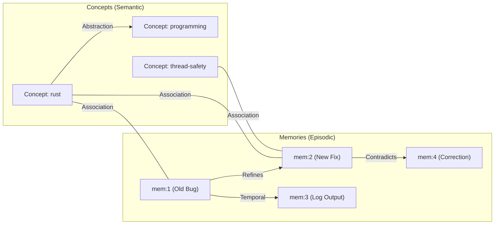
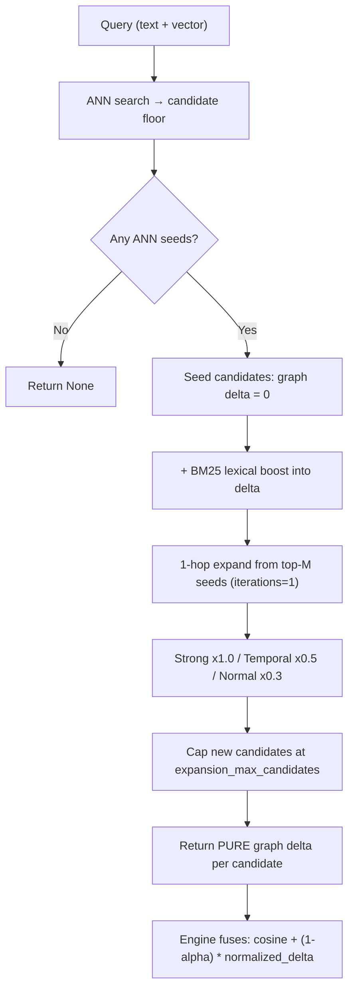
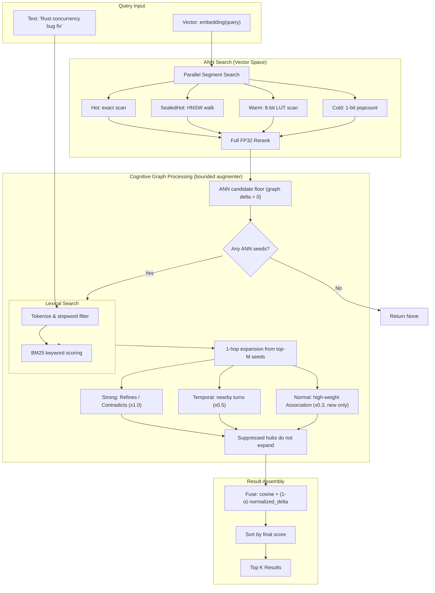
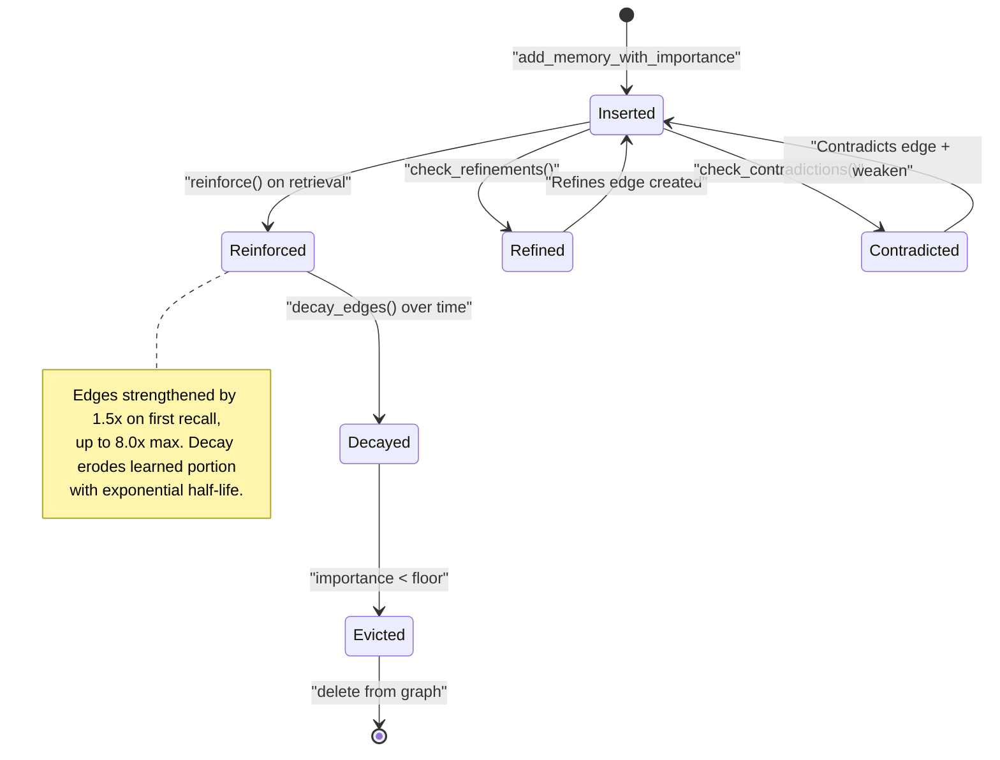

# Cognitive Memory Graph Subsystem

This document provides a comprehensive technical overview of `turbomemory_graph` (located in [crates/turbomemory_graph](file:///d:/personal-projects/TurboSuperMemory/crates/turbomemory_graph)), which acts as the episodic-semantic reasoning layer of the memory engine.

---

## 1. Graph Model and Topology

TurboSuperMemory models memory not as isolated vectors, but as an **Episodic-Semantic Graph** mapping relationships between events, concepts, and time.

### 1.1 Nodes
* **Memory Nodes** (`NodeId::Memory`): Store the raw text of individual episodes.
* **Concept Nodes** (`NodeId::Concept`): Abstract entities (e.g., topics, names, actions) extracted from memories.

### 1.2 Edge Types and Cognitive Semantics
* **`Association`**: Bi-directional links between memories and their constituent concepts. Built automatically via concept extraction.
* **`Temporal`**: Directed links connecting chronologically adjacent memories. Enables temporal context recall ("what happened next?").
* **`Abstraction`**: Direct hierarchy between concepts (e.g., `rust` → `programming language`). Built through concept co-occurrence analysis.
* **`Refines`**: Directed link from an older memory to a newer memory (Old → New). Used when an agent updates its understanding of a specific topic. The older memory remains in the graph (preserving history), but activation flows to the newer refinement.
* **`Contradicts`**: Directed link from an older memory to a newer correction (Old → New). Similar to `Refines` for energy propagation, but the older memory's outgoing association edges are weakened by `contradiction_weaken_factor` (default `0.5`), causing it to fade from standard queries over time.

---

## 2. Bounded Cognitive Augmenter

Retrieval follows an **ANN-floor + bounded augmenter** model. The dense ANN top-k is a non-negotiable recall floor; cognition performs a single bounded 1-hop graph expansion that can only *add* candidates and apply a small **additive, non-negative re-rank boost**. Cognition can surface and reorder, but it can **never drop an ANN hit** (the path is monotonic with respect to the floor).

This deliberately replaces the previous multi-iteration spreading-activation hot path (4 iterations, lateral inhibition, per-query Feeling-of-Knowing gate, frontier truncation). That design was both slow and unsafe — it could reorder real ANN hits away — so it was removed from the read path. Heavy reasoning (refinement, contradiction, importance, vocabulary, decay, abstraction) now runs only during **consolidation**, where it shapes the edges that the cheap read path rides.

> **FOK gate removed from the hot path.** `search()` returns `None` only when there are no ANN seeds at all (an empty collection / no candidates), not via a tuned energy threshold.

### 2.1 The Graph Delta Contract (critical)

The augmenter ([`SpreadingActivation::search`](file:///d:/personal-projects/TurboSuperMemory/crates/turbomemory_graph/src/activation.rs)) returns a **pure graph delta** \(\Delta_{\text{graph}}(M) \ge 0\) per candidate — **cosine is never folded into the returned value.** The storage engine owns the authoritative exact-FP32 cosine and fuses the two (see §3).

Cosine seed scores *are* used internally — to pick which seeds to expand from and to weight the magnitude of propagated energy — but they are not added to the returned score. Folding cosine into the delta (a prior bug) made the normalized "graph signal" a monotone function of cosine, so the graph edges re-ranked **nothing** and cognition became a silent no-op. Keeping the delta pure is what lets a `Refines`/`Contradicts` edge actually surface a memory above its cosine-nearest neighbor.

### 2.2 Candidate Floor and Lexical Seeding

1. **ANN floor**: every ANN candidate is inserted with \(\Delta_{\text{graph}} = 0\), so it always appears in the result set and is ranked by exact cosine unless the graph adds a boost. Its cosine seed activation is recorded separately as \(E_{\text{seed}}(M) = \alpha_{\text{semantic}} \cdot \text{score}(M)\) for use in expansion (`semantic_alpha` default `1.0`).
2. **Lexical boost**: BM25 keyword scores, normalized against the top BM25 score, contribute to the delta:
   \[
   \Delta_{\text{graph}}(M) \mathrel{+}= \alpha_{\text{lexical}} \cdot \frac{\text{BM25}(Q, M)}{\max \text{BM25}}
   \]
   (`lexical_alpha` default `0.3`.)

### 2.3 Single 1-Hop Expansion

If `iterations > 0` (default `1`), the augmenter expands from the top-`seed_hops_from` ANN seeds (default `10`, clamped `[1, 20]`), chosen by cosine seed activation \(E_{\text{seed}}\). Outgoing edges are split into three pools, each with its own boost factor, and the total number of newly added candidates is capped at `expansion_max_candidates` (default `50`, clamped `[10, 200]`). The propagated signal for an edge is:
\[
\text{signal} = E_{\text{seed}}(\text{Source}) \cdot W_{\text{edge}} \cdot \text{decay}
\]
(`decay` default `0.5`.)

| Pool | Edge kinds | Re-ranks ANN hits? | Boost factor |
|---|---|---|---|
| **Strong** | `Refines`, `Contradicts` | Yes — always traversed, even to existing ANN candidates (this is what lets a correction outrank its cosine-nearest older memory) | `1.0` |
| **Temporal** | `Temporal` | Yes — surfaces nearby conversation turns | `0.5` |
| **Normal** | `Association` (weight ≥ `0.5`) | No — only *adds* candidates not already in the ANN floor (prevents flooding) | `0.3` |

`Abstraction` edges are not traversed on the read path; they are used during consolidation to shape `Association` weights. Suppressed hub concepts (see §5) do not propagate energy.

#### Concrete Numerical Example

Query: *"Rust borrow checker"*, with `cognitive_alpha = 0.5`, `semantic_alpha = 1.0`, `lexical_alpha = 0.3`, `decay = 0.5`.

1. **ANN floor + lexical seeding**:
   - `old_fact` ("Rust uses a borrow checker for memory safety") is the cosine-nearest: cosine `0.97`, so \(E_{\text{seed}} = 0.97\), \(\Delta_{\text{graph}}(\text{old}) = 0\) + BM25 boost.
   - `new_fact` ("Rust borrow checker enforces ownership rules at compile time") is farther in vector space: cosine `0.70`, \(E_{\text{seed}} = 0.70\), \(\Delta_{\text{graph}}(\text{new}) = 0\) + BM25 boost.
2. **1-hop expansion**: `old_fact` has a `Refines` edge → `new_fact` (weight `1.0`, strong pool). It propagates a pure-delta boost to the *target*:
   \[
   \Delta_{\text{graph}}(\text{new}) \mathrel{+}= E_{\text{seed}}(\text{old}) \cdot 1.0 \cdot 0.5 = 0.485
   \]
   `old_fact` receives no incoming strong boost (the edge points *out* of it).
3. **Fusion (§3)**: after normalizing the delta, `new_fact`'s large graph delta lifts its final score above `old_fact` despite the lower cosine — the refinement surfaces. `old_fact` is never dropped; it simply ranks below the newer fact.

---

## 3. Retrieval Score Fusion

The augmenter returns only the pure graph delta; the storage engine ([`StorageEngine::hydrate_and_fuse`](file:///d:/personal-projects/TurboSuperMemory/crates/turbomemory_storage/src/engine.rs)) re-hydrates each candidate's exact FP32 embedding, computes the authoritative cosine, normalizes the delta to `[0, 1]`, and produces the final ranking:
\[
\text{Final Score}(M) = \text{CosineSimilarity}(Q, M) + (1 - \alpha_{\text{cognitive}}) \cdot \frac{\Delta_{\text{graph}}(M)}{\max_j \Delta_{\text{graph}}(j)}
\]
* **\(\alpha_{\text{cognitive}} = 1.0\)**: pure cosine — the graph only decides which candidates exist, never their order.
* **\(\alpha_{\text{cognitive}} = 0.7\)**: the default — cognition ON, graph gets a bounded vote.
* **\(\alpha_{\text{cognitive}} = 0.5\)**: balanced blend giving the graph more influence.

Because the boost is additive and non-negative, it can reorder candidates and surface graph-discovered ones, but it can never push a candidate below cosine-only ranking — the ANN recall floor is preserved.

---

## 4. Compressed Cognitive State (CCS)

The Compressed Cognitive State (CCS) acts as the agent's active working memory. It is a short JSON-serialized structure kept in RAM and saved in the database metadata table.

### 4.1 Pluggable Compressor Model
The engine implements the [`CognitiveCompressor`](file:///d:/personal-projects/TurboSuperMemory/crates/turbomemory_graph/src/ccs.rs) trait:
1. **`DeterministicCompressor`**: A fast, local, rule-based compressor that trims oldest items and aggregates concepts when working memory limits are exceeded. No external API calls are made.
2. **`LlmCompressor`**: Forwards the current CCS, user input, and assistant response to an LLM closure. The LLM synthesizes and updates the cognitive state (e.g. keeping track of user preferences, active tasks, and context shifts).

---

## 5. Online Concept Vocabulary Evolution

Over time, concept nodes extracted from texts might contain synonyms (e.g. `"rust-lang"` and `"rust"`). The graph runs an online consolidation pass during background optimizations:

1. **Jaccard Co-occurrence Indexing**: Builds an index mapping concepts to the set of memories they appear in.
2. **Synonym Detection**: Calculates the Jaccard similarity index of memory sets between concept pairs:
   \[
   J(C_a, C_b) = \frac{|\text{Memories}(C_a) \cap \text{Memories}(C_b)|}{|\text{Memories}(C_a) \cup \text{Memories}(C_b)|}
   \]
3. **Alias Merging**: If \(J(C_a, C_b) \ge \text{overlap\_threshold}\), the concept node with the lower degree is merged into the higher degree node. Its edges are redirected, and the alias is durably saved in the `ConceptVocabulary` snapshot.
4. **Hub Suppression**: Concepts whose degrees exceed a configured percentage of total memories (e.g., common words like `"system"` or `"code"`) are marked as **suppressed hubs**. These hubs are blocked from propagating energy during spreading activation.

---

## 6. Automatic Importance Scoring

To prevent memory bloat and automate retention, the engine implements automatic importance scoring:

* **Retrieval Salience**: Every search access increases a memory's `access_score`.
* **Connectivity Boost**: Memories connected to canonical, high-degree concepts receive a bounded importance boost.
* **Auto-Recomputation**: During consolidation, the target importance is computed:
  \[
  I_{\text{target}} = \text{blend}(\text{Salience}, \text{Connectivity})
  \]
  The current importance is shifted toward this target using an exponential moving average learning rate:
  \[
  I_{\text{new}} = I_{\text{old}} + \gamma_{\text{lr}} \cdot (I_{\text{target}} - I_{\text{old}})
  \]
* **Edge Reweighting**: When importance is updated, the memory's associated edges are rescaled in [`MemoryGraph::reweight_memory`](file:///d:/personal-projects/TurboSuperMemory/crates/turbomemory_graph/src/graph.rs) relative to its `base_importance_factor`, preserving any extra weights gained from retrieval reinforcement.
* **Eviction**: Memories whose importance decays below `importance_floor` are marked for eviction, freeing up index space.

---

## 7. Complete Cognitive Retrieval Pipeline

The following diagram shows the full end-to-end cognitive retrieval pipeline, from query ingestion to final result ranking:

---

## 8. Graph Introspection API

The cognitive graph exposes a read-only introspection API for debugging and "what does the AI know" views:

| Method | Returns | Description |
|---|---|---|
| `graph_stats()` | `(node_count, edge_count, memory_count, concept_count, ...)` | High-level graph statistics |
| `get_concepts()` | `list[(concept, degree)]` | All concepts sorted by degree |
| `get_memory_concepts(id)` | `list[str]` | Concepts attached to a memory |
| `get_refinements(id)` | `list[(id, weight)]` | Memories that refine this one |
| `get_contradictions(id)` | `list[(id, weight)]` | Memories that contradict this one |

---

## 9. Memory Lifecycle in the Graph

