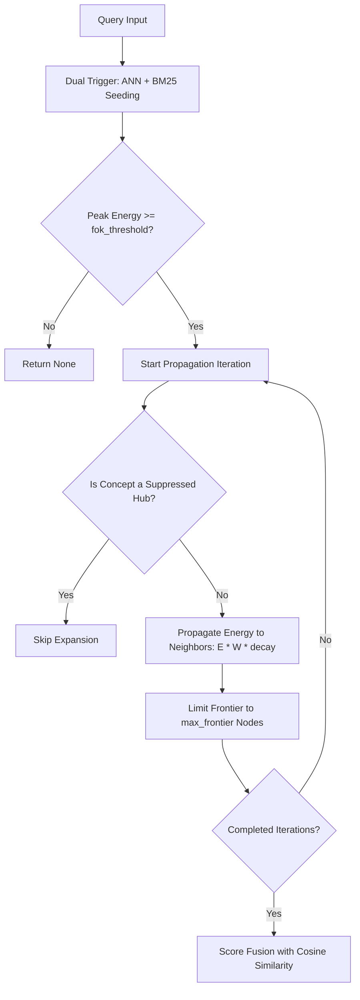

# Cognitive Memory Graph Subsystem

This document provides a comprehensive technical overview of `turbomemory_graph` (located in [crates/turbomemory_graph](file:///d:/personal-projects/TurboSuperMemory/crates/turbomemory_graph)), which acts as the episodic-semantic reasoning layer of the memory engine.

---

## 1. Graph Model and Topology

TurboSuperMemory models memory not as isolated vectors, but as an **Episodic-Semantic Graph** mapping relationships between events, concepts, and time.

```mermaid
graph LR
    subgraph Concepts (Semantic)
        C1[Concept: rust] -- Abstraction --> C2[Concept: programming]
        C3[Concept: thread-safety]
    end
    subgraph Memories (Episodic)
        M1["mem:1 (Old Bug)"] -- Refines --> M2["mem:2 (New Fix)"]
        M1 -- Temporal --> M3["mem:3 (Log Output)"]
        M2 -- Contradicts --> M4["mem:4 (Correction)"]
    end
    C1 -- Association --- M1
    C1 -- Association --- M2
    C3 -- Association --- M2
```

### 1.1 Nodes
* **Memory Nodes** (`NodeId::Memory`): Store the raw text of individual episodes.
* **Concept Nodes** (`NodeId::Concept`): Abstract entities (e.g., topics, names, actions) extracted from memories.

### 1.2 Edge Types and Cognitive Semantics
* **`Association`**: Bi-directional links between memories and their constituent concepts. Built automatically via concept extraction.
* **`Temporal`**: Directed links connecting chronologically adjacent memories. Enables temporal context recall ("what happened next?").
* **`Abstraction`**: Direct hierarchy between concepts (e.g., `rust` $\rightarrow$ `programming language`). Built through concept co-occurrence analysis.
* **`Refines`**: Directed link from an older memory to a newer memory (Old $\rightarrow$ New). Used when an agent updates its understanding of a specific topic. The older memory remains in the graph (preserving history), but activation flows to the newer refinement.
* **`Contradicts`**: Directed link from an older memory to a newer correction (Old $\rightarrow$ New). Similar to `Refines` for energy propagation, but the older memory's outgoing association edges are weakened by `contradiction_weaken_factor` (default `0.5`), causing it to fade from standard queries over time.

---

## 2. Spreading Activation Algorithm

Spreading Activation is the process of retrieving memories by propagating energy outward from initial "triggers" across graph edges.

### 2.1 Initialization (Dual-Trigger Seeding)
The query triggers initial energy inputs:
1. **Semantic Seed**: Scores from the dense approximate nearest neighbor (ANN) search are scaled:
   \[
   E_{\text{semantic}}(M) = \alpha_{\text{semantic}} \cdot \text{CosineSimilarity}(Q, M)
   \]
2. **Lexical Seed**: BM25 keyword matching scores normalized against the highest BM25 score:
   \[
   E_{\text{lexical}}(M) = \alpha_{\text{lexical}} \cdot \frac{\text{BM25}(Q, M)}{\max \text{BM25}}
   \]
Total initial energy is the sum of semantic and lexical triggers: \(E_0(M) = E_{\text{semantic}} + E_{\text{lexical}}\).

### 2.2 Feeling-of-Knowing (FOK) Gate
Before propagating energy, the engine checks the peak seed energy:
\[
\max(E_0) < \text{fok\_threshold}
\]
If the condition is met, the query is rejected early (returns `None`). This prevents the system from generating irrelevant memories or hallucinations when the query is completely unrelated to the agent's knowledge base.

### 2.3 Energy Propagation Loop
For a configured number of iterations (typically 4):
1. **Expansion**: Active nodes propagate energy to all neighbors:
   \[
   \Delta E(Target) = E(Source) \cdot W_{\text{edge}} \cdot \text{decay\_factor}
   \]
2. **Refines / Contradicts Priority**: Energy flows forward along `Refines` and `Contradicts` edges, channeling retrieval towards the latest factual states.
3. **Frontier Truncation**: To prevent activation from blowing up (which happens when touching high-degree "hub" concepts), only the top `max_frontier` (default `1,000`) highest-energy nodes are kept at each iteration.



---

## 3. Retrieval Score Fusion

After spreading activation completes, the final retrieval ranking is decided by fusing the dense vector cosine similarity and the graph's activation energy:
\[
\text{Final Score} = \alpha_{\text{cognitive}} \cdot \text{CosineSimilarity} + (1 - \alpha_{\text{cognitive}}) \cdot \text{NormalizedActivation}
\]
* **\(\alpha_{\text{cognitive}} = 1.0\)**: Pure vector search (default).
* **\(\alpha_{\text{cognitive}} = 0.5\)**: Balanced blend of semantic similarity and graph-derived contextual associations.

---

## 4. Compressed Cognitive State (CCS)

The Compressed Cognitive State (CCS) acts as the agent's active working memory. It is a short JSON-serialized structure kept in RAM and saved in the database metadata table.

### 4.1 Pluggable Compressor Model
The engine implements the [`CognitiveCompressor`](file:///d:/personal-projects/TurboSuperMemory/crates/turbomemory_graph/src/ccs.rs) trait:
1. **`DeterministicCompressor`**: A fast, local, rule-based compressor that trims oldest items and aggregates concepts when working memory limits are exceeded. No external API calls are made.
2. **`LlmCompressor`**: Forwards the current CCS, user input, and assistant response to an LLM closure. The LLM synthesizes and updates the cognitive state (e.g. keeping track of user preferences, active tasks, and context shifts).

---

## 5. Online Concept Vocabulary Evolution

Over time, concept nodes extracted from texts might contain synonyms (e.g. `"rust-lang"` and `"rust"`). The graph runs an online consolidation pass during background optimizations:

1. **Jaccard Co-occurrence Indexing**: Builds an index mapping concepts to the set of memories they appear in.
2. **Synonym Detection**: Calculates the Jaccard similarity index of memory sets between concept pairs:
   \[
   J(C_a, C_b) = \frac{|\text{Memories}(C_a) \cap \text{Memories}(C_b)|}{|\text{Memories}(C_a) \cup \text{Memories}(C_b)|}
   \]
3. **Alias Merging**: If \(J(C_a, C_b) \ge \text{overlap\_threshold}\), the concept node with the lower degree is merged into the higher degree node. Its edges are redirected, and the alias is durably saved in the `ConceptVocabulary` snapshot.
4. **Hub Suppression**: Concepts whose degrees exceed a configured percentage of total memories (e.g., common words like `"system"` or `"code"`) are marked as **suppressed hubs**. These hubs are blocked from propagating energy during spreading activation.

---

## 6. Automatic Importance Scoring

To prevent memory bloat and automate retention, the engine implements automatic importance scoring:

* **Retrieval Salience**: Every search access increases a memory's `access_score`.
* **Connectivity Boost**: Memories connected to canonical, high-degree concepts receive a bounded importance boost.
* **Auto-Recomputation**: During consolidation, the target importance is computed:
  \[
  I_{\text{target}} = \text{blend}(\text{Salience}, \text{Connectivity})
  \]
  The current importance is shifted toward this target using an exponential moving average learning rate:
  \[
  I_{\text{new}} = I_{\text{old}} + \gamma_{\text{lr}} \cdot (I_{\text{target}} - I_{\text{old}})
  \]
* **Edge Reweighting**: When importance is updated, the memory's associated edges are rescaled in [`MemoryGraph::reweight_memory`](file:///d:/personal-projects/TurboSuperMemory/crates/turbomemory_graph/src/graph.rs) relative to its `base_importance_factor`, preserving any extra weights gained from retrieval reinforcement.
* **Eviction**: Memories whose importance decays below `importance_floor` are marked for eviction, freeing up index space.
