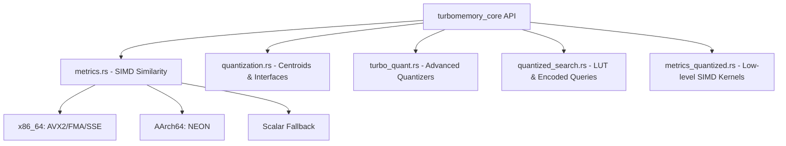
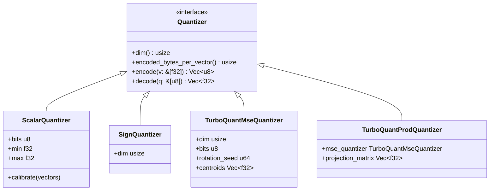
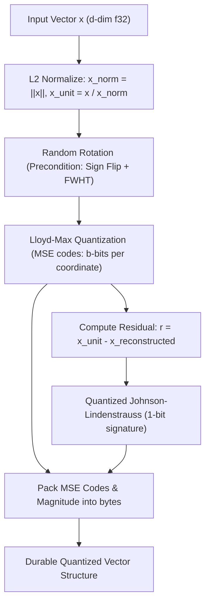
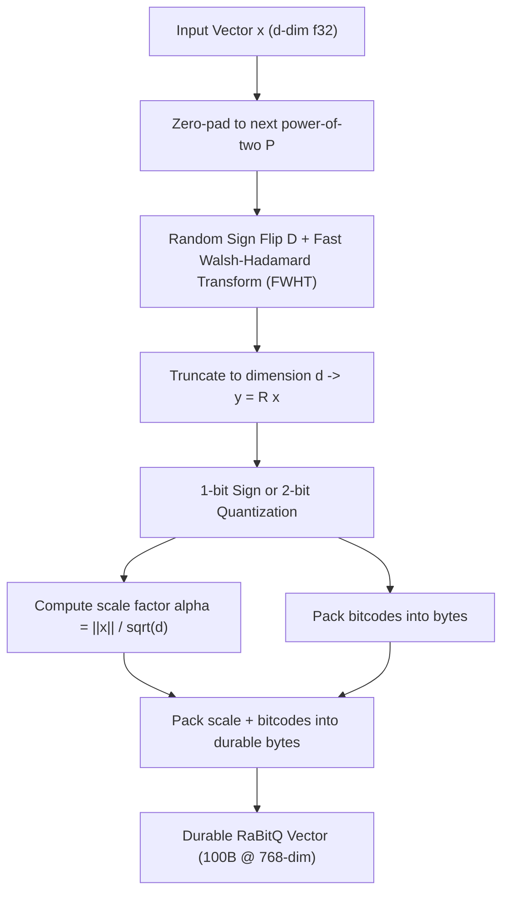
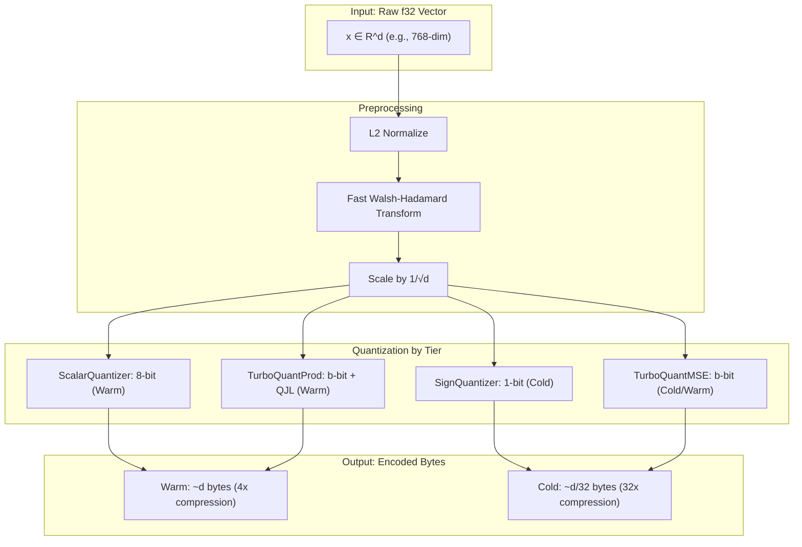
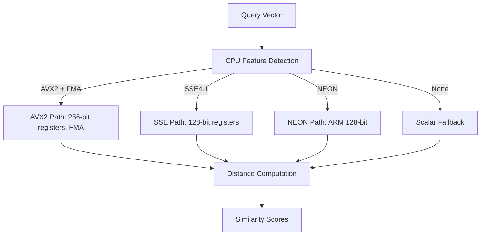
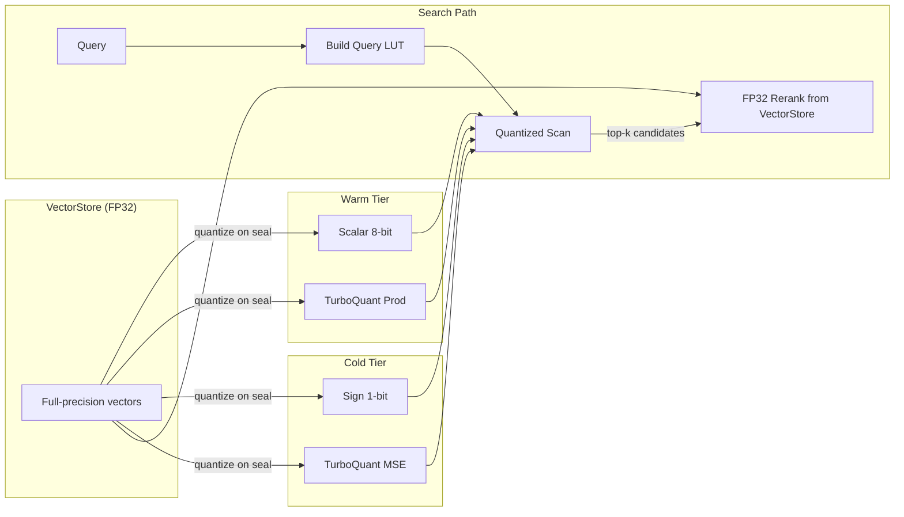

# Core Math, SIMD, and Quantization Subsystem

This document provides a deep-dive explanation of `turbomemory_core` (located in [crates/turbomemory_core](file:///d:/personal-projects/TurboSuperMemory/crates/turbomemory_core)), which handles vector similarity, hardware acceleration, and memory-saving quantization algorithms.

---

## 1. Subsystem Architecture

The `turbomemory_core` crate is a pure-math crate. It has **no I/O, no concurrency, and no external dependencies** besides standard math libraries and serialization/deserialization helper crates (such as `serde` and `rand`). This clean separation ensures that mathematical kernels can be compiled and optimized independently.



---

## 2. SIMD Vector Distance Kernels

To scale search to millions of vectors, distance calculations are accelerated using hardware SIMD (Single Instruction, Multiple Data) instructions. At runtime, the system detects CPU capabilities and dispatches to the most optimized implementation:

1. **AVX2 + FMA (x86_64)**: Computes 8 float-operations in parallel using 256-bit registers and fused multiply-accumulate (`_mm256_fmadd_ps`).
2. **SSE / SSE4.1 (x86_64)**: SSE instructions acting as a fallback on older x86 hardware.
3. **NEON (aarch64)**: Apple Silicon and ARM servers use NEON vector registers.
4. **Scalar Fallback**: Pure Rust loops for generic hardware architectures.

### Metric Implementations

Three distance metrics are exposed through the [`Metric`](file:///d:/personal-projects/TurboSuperMemory/crates/turbomemory_core/src/metrics.rs#L15) trait:

* **Cosine similarity**: Normalizes the vectors to unit L2-norm first:
  \[
  \text{Cosine}(a, b) = \frac{a \cdot b}{\|a\| \|b\|}
  \]
  After L2-normalization, the cosine similarity becomes a simple dot product: \(a \cdot b\).
* **Dot Product**: Direct inner product of vectors without preprocessing.
* **Negative Squared Euclidean Distance**: Used to match the Euclidean distance behavior:
  \[
  -\|a - b\|^2_2 = -\sum_{i=1}^d (a_i - b_i)^2
  \]
  A higher similarity score corresponds to a smaller distance.

---

## 3. Fast Walsh-Hadamard Transform (FWHT) & Preconditioning

High-dimensional text embeddings are typically clustered, which concentrates variance in a subset of dimensions. Standard quantization schemes suffer high distortion under such uneven distributions.

To counter this, `turbomemory_core` implements **randomized preconditioning**, also known as **Fast Approximate Random Rotation**:

1. **Random Sign Flipping**: The vector is multiplied by a pseudo-random diagonal matrix \(D\) with entries \(\pm 1\) generated deterministically using a seed:
   \[
   y_i = x_i \cdot \text{sign}(\text{rng})
   \]
2. **Walsh-Hadamard Transform**: The Fast Walsh-Hadamard Transform (FWHT) is applied to distribute energy uniformly across all dimensions. FWHT operates in \(O(d \log d)\) time (as opposed to \(O(d^2)\) for a full rotation matrix) using in-place butterfly operations:
   \[
   H_d = \frac{1}{\sqrt{2}} \begin{pmatrix} H_{d/2} & H_{d/2} \\ H_{d/2} & -H_{d/2} \end{pmatrix}
   \]
3. **Norm Preservation**: The vector is scaled by \(1/\sqrt{d}\) to ensure the operation remains strictly orthogonal (norm-preserving).

Post-rotation, the coordinate coordinates follow an approximately independent Gaussian distribution:
\[
y_i \sim \mathcal{N}(0, 1/d)
\]
This makes the vector manifold highly amenable to uniform codebook-based quantization.

---

## 4. Quantization Schemes & Math

To reduce memory consumption in the **Warm** and **Cold** tiers, vectors are quantized into compressed representations. The crate offers four main quantizer options:



### 4.1 Lloyd-Max Quantizer

Lloyd-Max quantization is the mathematically optimal scalar quantizer for a given probability density function (PDF). Since preconditioning projects vector dimensions into a normal distribution \(\mathcal{N}(0, 1/d)\), `turbomemory_core` stores precomputed [Lloyd-Max centroids](file:///d:/personal-projects/TurboSuperMemory/crates/turbomemory_core/src/quantization.rs#L19-L55) for \(\mathcal{N}(0, 1)\) at resolutions between 1 and 8 bits. During quantization, these centroids are scaled by \(1/\sqrt{d}\).

### 4.2 Scalar Quantizer (Warm Tier Default)

The [`ScalarQuantizer`](file:///d:/personal-projects/TurboSuperMemory/crates/turbomemory_core/src/quantization.rs#L62) is calibrated on a sample dataset to compute a global min/max range. Each float dimension is mapped linearly to a \(b\)-bit unsigned integer (typically 8 bits for the Warm tier):
\[
q_i = \text{round}\left( \frac{x_i - \text{min}}{\text{max} - \text{min}} \cdot (2^b - 1) \right)
\]

* **Compression**: 4x compression (32-bit float to 8-bit int).
* **Search**: Direct SIMD dot-product against float queries without prior decompression.

### 4.3 1-bit Sign Quantizer (Cold Tier Default)

For maximum compression, the [`SignQuantizer`](file:///d:/personal-projects/TurboSuperMemory/crates/turbomemory_core/src/quantization.rs#L211) quantizes each dimension to its sign:
\[
q_i = \begin{cases} 1 & \text{if } x_i \ge 0 \\ 0 & \text{if } x_i < 0 \end{cases}
\]
Each coordinate is packed into a single bit, giving **32x compression**.

* **Memory footprint**: 768 dimensions compressed to 96 bytes.
* **Similarity computation**: Estimated using Hamming distance or XOR-based popcount.

### 4.4 TurboQuant MSE-optimal Quantizer

Implements the MSE-optimal quantizer from the paper *"TurboQuant: Online Vector Quantization with Near-optimal Distortion Rate"*. 

* **Algorithm**:
  1. L2-normalizes the vector and stores the original magnitude (norm) as a 16-bit or 32-bit float.
  2. Applies Fast Approximate Random Rotation (preconditioning).
  3. Quantizes the rotated coordinates using the scaled Lloyd-Max centroids.
* **Benefits**: Guarantees bounded distortion under arbitrary dimensionality, minimizing mean squared error (MSE) relative to standard scalar quantization.

### 4.5 TurboQuant Inner-Product (Prod) Quantizer

Extends the MSE quantizer to preserve the inner product (unbiased dot product estimator):

* **Algorithm**:
  1. Quantizes the vector using `TurboQuantMseQuantizer` to capture the principal magnitude.
  2. Computes the quantization residual: \(r = x - \text{decode}(q_{mse})\).
  3. Applies a Quantized Johnson-Lindenstrauss (QJL) random projection to the residual \(r\), storing a secondary 1-bit signature.
* **Benefits**: The secondary signature provides correction factors that yield an unbiased estimator of dot products, which is crucial for high-accuracy cosine/dot-product retrieval.



### 4.6 RaBitQ Quantizer (Universal Dimension 1-bit / 2-bit Quantization)

Implements Randomized Binary Quantization with universal dimension support (arbitrary non-power-of-two dimensions such as 384, 768, 1536):

* **Algorithm**:
  1. **Zero-Padded Orthogonal Preconditioning**: Vector $x \in \mathbb{R}^d$ is padded to $P = 2^{\lceil \log_2 d \rceil}$, multiplied by deterministic random signs $D \in \{-1, +1\}^P$, transformed via Fast Walsh-Hadamard Transform `fwht(&mut buf)`, and truncated back to dimension $d$.
  2. **Packed Quantization**:
     * **1-bit Mode**: $b_i = \mathbb{I}(y_i \ge 0)$, storing scale factor $\alpha = \frac{\|x\|_2}{\sqrt{d}}$ as a 32-bit float ($100\text{ bytes}$ for 768-d, **$30.7\times$ compression**).
     * **2-bit Mode**: Non-uniform Lloyd-Max 2-bit Lloyd bins, storing $\alpha$ ($196\text{ bytes}$ for 768-d, **$15.7\times$ compression**).
  3. **Asymmetric Inner Product via LUT**: Query $q$ is rotated to $q' = R q$. For each coordinate byte, a precomputed lookup table evaluates:
     \[
     \langle q, x \rangle \approx \alpha \sum_{j=0}^{\lceil d/8 \rceil - 1} T_j[\text{code}[j]]
     \]
* **Benefits**:
  * **Zero Dimension Constraints**: Natively supports 384-d, 768-d, and 1536-d embedding models where TurboQuant cannot run.
  * **Ultra-Fast Throughput**: $>2,100\text{ vectors/sec}$ ingestion and $>50\text{M}$ vectors/sec/core scoring.





---

## 5. Quantized Search & Lookup Tables (LUT)

To prevent decompression overhead, `turbomemory_core` uses Lookup Tables (LUTs) and customized SIMD kernels to score compressed vectors directly.

### 5.1 Scalar Quantized Dot Product

Instead of decompressing, the SIMD kernel executes:
\[
\text{dot} = \sum q_i \cdot (\text{query}_i \cdot \text{scale}) + \sum \text{query}_i \cdot \text{min}
\]
By pre-calculating the constants, the inner loop loads the byte array, zero-extends it to floats, and runs a fused-multiply-add:
```rust
// Load 8 u8 codes, convert to f32, and compute: acc += query * (min + code * scale)
let codes = _mm_loadl_epi64(encoded.as_ptr().add(i) as *const _);
let codes_i32 = _mm256_cvtepu8_epi32(codes);
let codes_f32 = _mm256_cvtepi32_ps(codes_i32);
let values = _mm256_fmadd_ps(codes_f32, v_scale, v_min);
let q = _mm256_loadu_ps(query.as_ptr().add(i));
acc = _mm256_fmadd_ps(q, values, acc);
```

### 5.2 Sign Quantized Lookup Table (LUT)

For 1-bit sign-quantized search, the engine builds a query-specific lookup table in [`SignEncodedQuery::new`](file:///d:/personal-projects/TurboSuperMemory/crates/turbomemory_core/src/quantized_search.rs#L95):

1. It groups the dimensions into 8-coordinate chunks (1 byte).
2. For each byte position and all 256 possible byte values, it precomputes the dot product contribution:
   \[
   \text{LUT}[\text{byte\_idx}][\text{byte\_value}] = \sum_{j=0}^7 \text{query}_{\text{byte\_idx} \cdot 8 + j} \cdot (2 \cdot \text{bit}_j - 1)
   \]
3. At search time, scoring an encoded vector is an addition of byte lookups:
   \[
   \text{Score} = \sum_{\text{byte\_idx}} \text{LUT}[\text{byte\_idx}][\text{encoded}[\text{byte\_idx}]]
   \]
   This completely bypasses bit manipulation, achieving millions of vector comparisons per second per CPU core.

---

## 6. SIMD Dispatch Architecture

The core uses runtime CPU feature detection to dispatch to the optimal SIMD implementation:



### 6.1 Feature Detection Hierarchy

| Priority | Feature | Registers | Operations per Instruction | Target CPUs |
|---|---|---|---|---|
| 1 | AVX2 + FMA | 256-bit (8 floats) | 8 FMA ops | Intel Haswell+, AMD Zen+ |
| 2 | SSE4.1 | 128-bit (4 floats) | 4 ops | Intel Core 2+, older AMD |
| 3 | NEON | 128-bit (4 floats) | 4 ops | Apple Silicon, ARM servers |
| 4 | Scalar | 64-bit (1 float) | 1 op | Generic fallback |

### 6.2 Batched Kernel Unrolling

For maximum throughput, the core implements batched distance kernels with 4-vector unrolling:

```rust
// Process 4 vectors simultaneously using AVX2
for chunk in vectors.chunks_exact(4) {
    let (dot0, dot1, dot2, dot3) = dot_and_nb_x4_avx2(query, chunk);
    // Accumulate 4 results per iteration
}
```

This amortizes the cost of loading the query vector across 4 distance computations, achieving near-peak memory bandwidth utilization.

---

## 7. Quantization vs Accuracy Trade-offs

| Quantizer | Bits | Compression | Recall@10 (768-dim) | Speed | Use Case |
|---|---|---|---|---|---|
| FP32 (baseline) | 32 | 1x | 100% | Baseline | Hot tier, reranking |
| Scalar 8-bit | 8 | 4x | ~95% | Fast | Warm tier default |
| TurboQuant Prod | 4 | 8x | ~92% | Fast | Warm tier alternative |
| TurboQuant MSE | 2 | 16x | ~85% | Very Fast | Cold tier alternative |
| Sign 1-bit | 1 | 32x | ~71% | Fastest | Cold tier default |

*Note: Recall figures are approximate and depend on dataset characteristics. Clustered embeddings (realistic text) show higher recall than random Gaussian data.*

---

## 8. Integration with Storage Tiers


