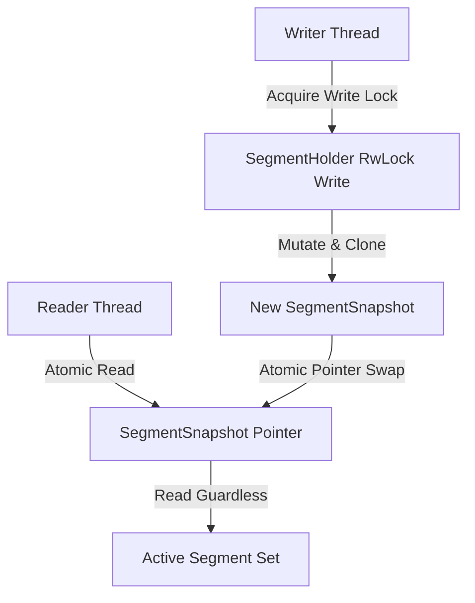
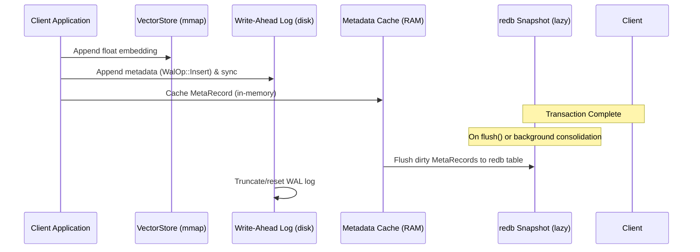
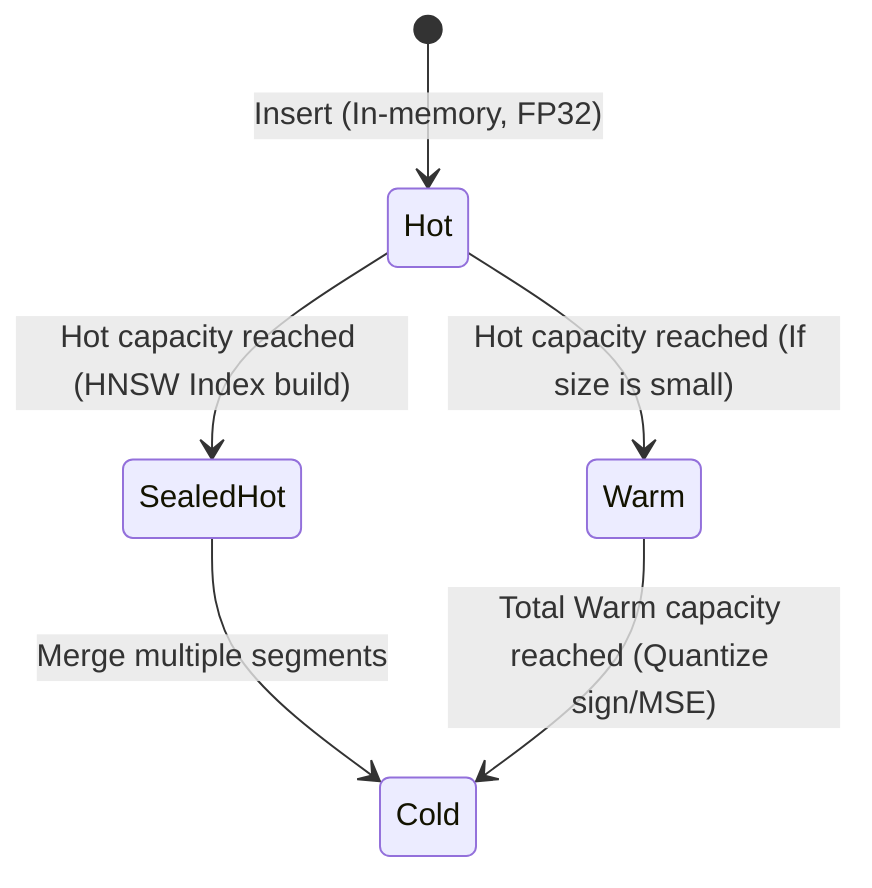

# Storage, Durability, and Segment Tiers Subsystem

This document provides a detailed technical overview of `turbomemory_storage` (located in [crates/turbomemory_storage](file:///d:/personal-projects/TurboSuperMemory/crates/turbomemory_storage)), which handles multi-agent namespace isolation, mmap vector storage, transactional durability, tiered indexing, and concurrent read/write locks.

---

## 1. Concurrency and Lock Architecture

`StorageEngine` is designed for high-concurrency environments. It uses a **lock-free-reader / exclusive-writer** design for searching, while using granular locking for mutations.

* **`arc_swap` Snapshots**: The active searchable segments are published atomically using `arc_swap::ArcSwap<SegmentSnapshot>`. Read paths (like searches) perform a lock-free pointer swap clone of the snapshot and scan the segments without holding any mutexes or read locks.
* **Granular locks**: Internal structures use `parking_lot::RwLock` and `parking_lot::Mutex` which are faster and more memory-efficient than standard library synchronization primitives.
  - `segments: Arc<RwLock<SegmentHolder>>`
  - `graph: Arc<RwLock<SpreadingActivation>>`
  - `id_index: Arc<RwLock<AHashMap<Arc<str>, PointOffset>>>`
  - `payload_index: Arc<RwLock<PayloadIndex>>`
  - `scope_index: Arc<RwLock<ScopeIndex>>`
  - `wal: Arc<Mutex<Wal>>`

---

## 2. Multi-Agent Scoping

To support multi-agent systems, memories can be partitioned using the `scope` field:
* **Global/Shared Scope** (`scope = None`): Visible to all agents.
* **Scoped Namespace** (`scope = Some(agent_id)`): Private memory visible only to the specified agent.

The [`ScopeIndex`](file:///d:/personal-projects/TurboSuperMemory/crates/turbomemory_storage/src/scope_index.rs) maintains in-memory roaring bitmaps:
* `by_scope: AHashMap<String, RoaringBitmap>`
* `global: RoaringBitmap`

During a search query with `Some(agent_id)`, the engine performs a fast bitmap union:
\[
\text{Allowed Offsets} = \text{global} \cup \text{by\_scope}[\text{agent\_id}]
\]
This bitmap filter is passed directly to the segment search traversal, ensuring strict isolation at zero extra query cost.

---

## 3. Vector Store (`vectors.bin`)

Full-precision vector embeddings are kept in a single mmap-backed file, [`VectorStore`](file:///d:/personal-projects/TurboSuperMemory/crates/turbomemory_storage/src/vector_store.rs). 

* **Binary Format**:
  - **Header** (32 bytes): Magic signature (`b"TMDV"`), Version (`u32`), Dimension (`u32`), record count (`u64`), and a CRC32-C checksum of the header.
  - **Contiguous Floats**: Raw `f32` vectors appended sequentially.
* **Mmap Growth Strategy**: To prevent frequent memory-mapping operations, the backing file grows geometrically (e.g., doubling size or allocating in large chunks).
* **Reranking Utility**: The `VectorStore` does not store metadata. It is solely responsible for storing raw float coordinates. Tiered segments search using low-precision quantizers, and then load full-precision coordinates from the mmap'd `VectorStore` to perform high-fidelity cosine reranking.

---

## 4. Durability Model (WAL & redb Snapshots)

TurboSuperMemory uses a tiered persistence model to balance write throughput with transactional correctness:

### 4.1 Write-Ahead Log (WAL)
Every metadata write (insert, update, delete) is appended to an append-only Write-Ahead Log (`wal_meta.bin`).
* **Frame format**: `[magic: 4 bytes "TMSW"] [version: u32] [payload length: u32] [payload bytes (bincode WalOp)] [crc32-c: u32]`.
* **Zero Embeddings in WAL**: Full embeddings are written directly to `VectorStore` and are *never* written to the WAL. The WAL only logs the `PointOffset`, `MetaRecord` (attributes, text, concepts), and monotonic `seq` number. This keeps the write throughput high.

### 4.2 Lazy Snapshotting via `redb`
`redb` acts as a lazy snapshot database (`memory.redb`):
* All records are stored in the `records` table, keyed by `PointOffset`, serialized using `bincode`.
* Engine configurations, current sequence counters, serialized cognitive graph state, and Compressed Cognitive State (CCS) are stored in the `meta` key-value table.
* The WAL is truncated/cleared only when `redb` is successfully flushed to disk.

### 4.3 Crash Recovery Protocol
On database open:
1. Load the last consistent snapshot from `memory.redb` (populating the graph, CCS, and metadata cache).
2. Open the WAL. Replay any records found in the WAL that have a sequence number higher than the snapshot.
3. Repopulate the in-memory indexes (ID index, text search index, scope index, payload filter index).
4. Persist the updated snapshot to `memory.redb` and truncate the WAL.

---

## 5. Segment Tiers & Lifecycle

TurboSuperMemory employs four distinct tiers to optimize vector search speed, memory usage, and build times.

| Tier | Mutability | Backing Storage | Search Execution |
|---|---|---|---|
| **Hot** | Read-Write | In-memory `Vec<PointOffset>` + `VectorStore` | Parallel Exact scan (SIMD batched) |
| **SealedHot** | Read-Only | persisted `usearch` HNSW index file | HNSW graph walk. Low-selectivity filters fall back to exact scan. |
| **Warm** | Read-Only | Quantized mmap data (scalar/TurboQuant prod) | Quantized LUT SIMD scan + full-f32 rerank. |
| **Cold** | Read-Only | Quantized mmap data (sign/TurboQuant MSE) | Binary/quantized LUT SIMD scan + full-f32 rerank. |

### 5.1 Hot Segment
* New insertions land here.
* Searches perform a fast brute-force dot product of the query against the memory slice.

### 5.2 SealedHot Segment
* Once the Hot capacity (e.g., 10,000 records) is reached, the Hot segment is sealed.
* A background thread builds a `usearch` HNSW (Hierarchical Navigable Small World) index. Usearch is a header-only HNSW library. The index file is written to `segments/sealed_hot/`.

### 5.3 Warm Segment
* Compresses embeddings to 8-bit integers using `ScalarQuantizer` or `TurboQuantProdQuantizer`.
* Computes similarity using LUTs and AVX2-accelerated math directly on quantized bytes, then reranks the top candidates with full floats.

### 5.4 Cold Segment
* Compresses embeddings to 1-bit representations using `SignQuantizer` or `TurboQuantMseQuantizer`.
* Computes similarity using bitwise XOR and popcount lookups (extremely compact).

---

## 6. Background Consolidation and Optimizer

The [`BackgroundOptimizer`](file:///d:/personal-projects/TurboSuperMemory/crates/turbomemory_storage/src/optimizer.rs) runs continuously as a worker thread:
* **Consolidation**: Merges fragmented small segments into larger ones to keep search parallelization balanced.
* **Tiering**: Promotes/demotes segments based on access frequency. Frequently accessed Cold records can be promoted back to Hot via `promote_hot` if configured.
* **Vacuuming**: Deletes marked records from indices and rewrites segment tables to reclaim storage space.
