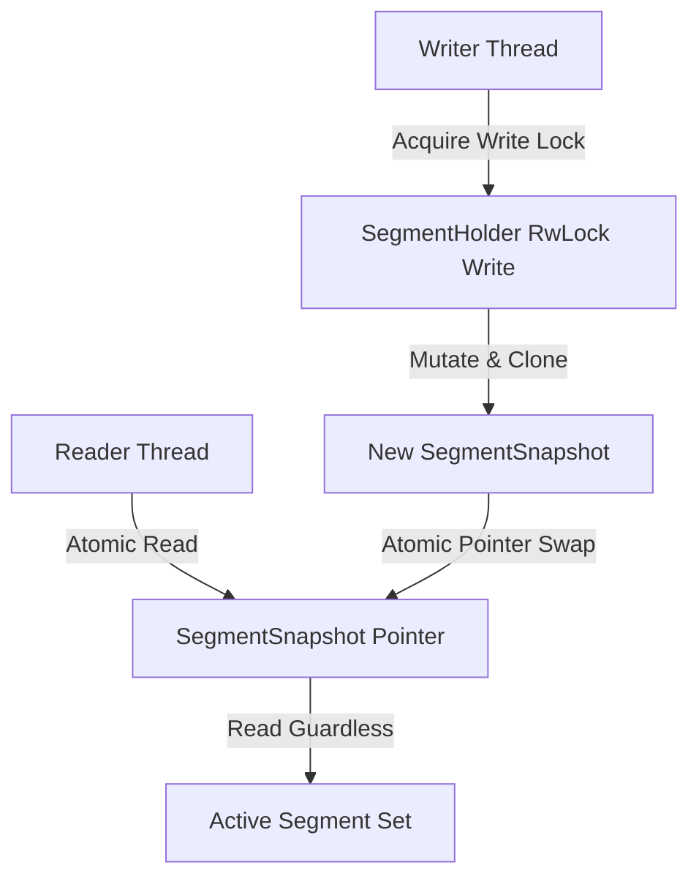
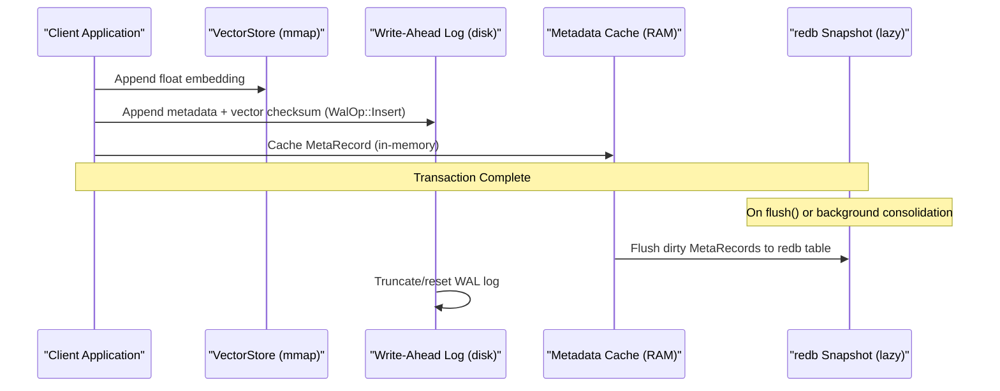
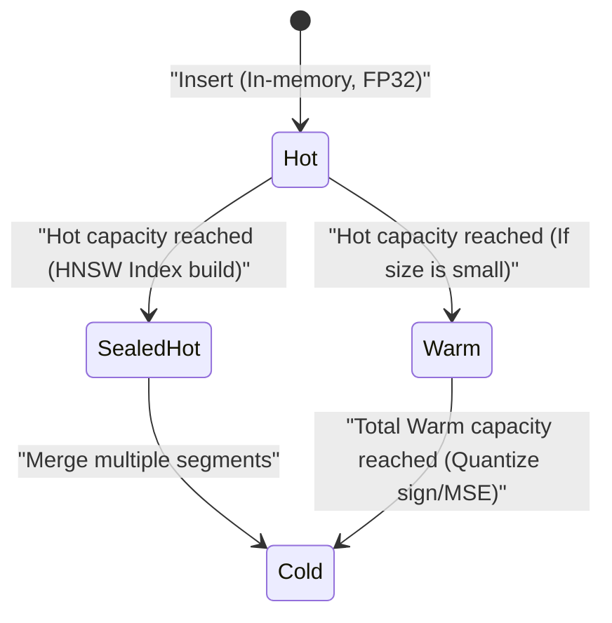

# Storage, Durability, and Segment Tiers Subsystem

This document provides a detailed technical overview of `turbomemory_storage` (located in [crates/turbomemory_storage](file:///d:/personal-projects/TurboSuperMemory/crates/turbomemory_storage)), which handles multi-agent namespace isolation, mmap vector storage, transactional durability, tiered indexing, and concurrent read/write locks.

---

## 1. Concurrency and Lock Architecture

`StorageEngine` is designed for high-concurrency environments. It uses a **lock-free-reader / exclusive-writer** design for searching, while using granular locking for mutations.

```mermaid
graph TD
    Reader["Reader Thread"] -- "Atomic Read" --> Snapshot["SegmentSnapshot Pointer"]
    Snapshot -- "Read Guardless" --> Segments["Active Segment Set"]
    Writer["Writer Thread"] -- "Acquire Write Lock" --> SegsLock["SegmentHolder RwLock Write"]
    SegsLock -- "Mutate & Clone" --> NewSnapshot["New SegmentSnapshot"]
    NewSnapshot -- "Atomic Pointer Swap" --> Snapshot
```

* **`arc_swap` Snapshots**: The active searchable segments are published atomically using `arc_swap::ArcSwap<SegmentSnapshot>`. Read paths (like searches) perform a lock-free pointer swap clone of the snapshot and scan the segments without holding any mutexes or read locks.
* **Granular locks**: Internal structures use `parking_lot::RwLock` and `parking_lot::Mutex` which are faster and more memory-efficient than standard library synchronization primitives.
  - `segments: Arc<RwLock<SegmentHolder>>`
  - `graph: Arc<RwLock<SpreadingActivation>>`
  - `id_index: Arc<RwLock<AHashMap<Arc<str>, PointOffset>>>`
  - `payload_index: Arc<RwLock<PayloadIndex>>`
  - `scope_index: Arc<RwLock<ScopeIndex>>`
  - `wal: Arc<Mutex<Wal>>`
  - `gpu: Arc<Mutex<Option<Arc<dyn GpuBackend>>>>` (lazy-initialized GPU backend)

### Lock Compatibility Matrix

| Operation / Resource | `segments` Lock | `graph` Lock | `id_index` Lock | `wal` Lock | `gpu` Lock |
|---|---|---|---|---|---|
| **Search (Read Path)** | None (Lock-free `arc_swap`) | Read Lock (Shared) | Read Lock (Shared) | None | None (GPU ops are lock-free after init) |
| **Insert / Update (Write Path)** | Write Lock (Exclusive) | Write Lock (Exclusive) | Write Lock (Exclusive) | Mutex (Exclusive Append) | None (GPU not used on write) |
| **Consolidation / Optimize** | Write Lock (Exclusive Swap) | Write Lock (Exclusive) | Read/Write Lock | Mutex (Exclusive Flush/Truncate) | None (GPU build uses owned data) |

---

## 2. Multi-Agent Scoping

To support multi-agent systems, memories can be partitioned using the `scope` field:
* **Global/Shared Scope** (`scope = None`): Visible to all agents.
* **Scoped Namespace** (`scope = Some(agent_id)`): Private memory visible only to the specified agent.

The [`ScopeIndex`](file:///d:/personal-projects/TurboSuperMemory/crates/turbomemory_storage/src/scope_index.rs) maintains in-memory roaring bitmaps:
* `by_scope: AHashMap<String, RoaringBitmap>`
* `global: RoaringBitmap`

During a search query with `Some(agent_id)`, the engine performs a fast bitmap union:
\[
\text{Allowed Offsets} = \text{global} \cup \text{by\_scope}[\text{agent\_id}]
\]
This bitmap filter is passed directly to the segment search traversal, ensuring strict isolation at zero extra query cost.

---

## 3. Vector Store (`vectors.bin`)

Full-precision vector embeddings are kept in a single mmap-backed file, [`VectorStore`](file:///d:/personal-projects/TurboSuperMemory/crates/turbomemory_storage/src/vector_store.rs). 

* **Binary Format**:
  - **Header** (32 bytes): Magic signature (`b"TMDV"`), Version (`u32`), Dimension (`u32`), record count (`u64`), and a CRC32-C checksum of the header.
  - **Contiguous Floats**: Raw `f32` vectors appended sequentially.
* **Mmap Growth Strategy**: To prevent frequent memory-mapping operations, the backing file grows geometrically (e.g., doubling size or allocating in large chunks).
* **Reranking Utility**: The `VectorStore` does not store metadata. It is solely responsible for storing raw float coordinates. Tiered segments search using low-precision quantizers, and then load full-precision coordinates from the mmap'd `VectorStore` to perform high-fidelity cosine reranking.

---

## 4. Durability Model (WAL & redb Snapshots)

TurboSuperMemory uses a tiered persistence model to balance write throughput with transactional correctness:

```mermaid
sequenceDiagram
    participant App as "Client Application"
    participant VS as "VectorStore (mmap)"
    participant WAL as "Write-Ahead Log (disk)"
    participant Cache as "Metadata Cache (RAM)"
    participant redb as "redb Snapshot (lazy)"

    App->>VS: Append float embedding
    App->>WAL: Append metadata + vector checksum (WalOp::Insert)
    App->>Cache: Cache MetaRecord (in-memory)
    Note over App, redb: Transaction Complete
    Note over redb: On flush() or background consolidation
    Cache->>redb: Flush dirty MetaRecords to redb table
    WAL->>WAL: Truncate/reset WAL log
```

### 4.1 Write-Ahead Log (WAL)
Every metadata write (insert, update, delete) is appended to an append-only Write-Ahead Log (`wal_meta.bin`).
* **File format**: an 8-byte header (`"TMSW"`, version), then frames of `[payload length: u32] [payload bytes (bincode WalOp)] [crc32: u32]`. Version 2 is current; version-1 logs left by older builds are still replayed.
* **Zero Embeddings in WAL**: Full embeddings are written directly to `VectorStore` and are *never* written to the WAL. An insert logs the `PointOffset`, the `MetaRecord` (attributes, text, concepts), the monotonic `seq`, and a **CRC32 of the vector**, which is what lets recovery confirm the vector reached the file.
* **Operations**: `Insert`, `Delete`, and `Replace` (an update: old offset out, new offset in, as one frame, so a crash can never leave the id pointing at nothing).
* **Sync policy**: frames are written with one `write` call each (batch inserts: one call for the batch) and fsynced by `flush()`. A killed process loses nothing; a power loss can lose the writes since the last flush. With `TierConfig::sync_writes` (Python: `sync_writes=True`, server: `TURBO_SYNC_WRITES=1`) each write instead syncs the vector range it wrote and then its WAL frames before it returns, in that order, because recovery drops a logged insert whose vector is not on disk. Measured cost on an NVMe SSD: 0.09 ms to 5.5 ms for a single insert, about 2.5 ms to 8 ms for a batch of 100. Newly created files and atomically renamed manifests also fsync their directory on POSIX systems.

### 4.2 Lazy Snapshotting via `redb`
`redb` acts as a lazy snapshot database (`memory.redb`):
* All records are stored in the `records` table, keyed by `PointOffset`, serialized using `bincode`.
* Engine configurations, current sequence counters, serialized cognitive graph state, and Compressed Cognitive State (CCS) are stored in the `meta` key-value table.
* The WAL is truncated/cleared only when `redb` is successfully flushed to disk. If the snapshot transaction fails, the dirty set is restored so the next flush retries the same records.

### 4.3 Crash Recovery Protocol
On database open:
1. Load the last consistent snapshot from `memory.redb` (populating the graph, CCS, and metadata cache).
2. Replay the WAL frames with a sequence number higher than the snapshot. For each insert, the vector is read **directly from its slot** in `vectors.bin` and checked against the logged CRC. (The vector file's header count is only stamped by `flush`, so it cannot be used to decide what exists; relying on it used to discard every insert since the last flush.) An insert whose vector fails the check is dropped: the vector never reached the file.
3. Stop at the first frame that is torn, fails its checksum, or cannot be decoded, and truncate the log there. A bad tail costs the damaged records, never the store.
4. Verify the two primary files agree: a record with no vector (`vectors.bin` missing or truncated) or vectors with no metadata (`memory.redb` missing or replaced) is reported as `StorageError::Corrupted`.
5. Load the segment directories. One without a manifest is an abandoned build and is removed. One that fails to load (bad manifest, missing or damaged index file, checksum mismatch) is discarded and its records go back to the Hot segment to be indexed again.
6. Repopulate the in-memory indexes (ID index, text search index, scope index, payload filter index), dropping graph nodes of records that no longer exist.
7. Persist the recovered snapshot to `memory.redb` and clear the WAL.

`StorageEngine::recovery_report()` (Python: `MemoryEngine.recovery_report()`) returns what steps 2–6 had to repair; it is all zeros after a clean shutdown.

### 4.4 Segment Files
Segment directories are named `segment_<n>` from a counter that continues past every directory already on disk. A segment's data file is written and synced first; its `manifest.json` is written last, to a temporary name and renamed into place, so a directory is either a complete segment or has no manifest. For HNSW segments the manifest records the index file's length and CRC32, checked before the file is mapped.

---

## 5. Segment Tiers & Lifecycle

TurboSuperMemory employs four distinct tiers to optimize vector search speed, memory usage, and build times.

```mermaid
stateDiagram-v2
    [*] --> Hot : "Insert (In-memory, FP32)"
    Hot --> SealedHot : "Hot capacity reached (HNSW Index build)"
    Hot --> Warm : "Hot capacity reached (If size is small)"
    SealedHot --> Cold : "Merge multiple segments"
    Warm --> Cold : "Total Warm capacity reached (Quantize sign/MSE)"
```

| Tier | Mutability | Quantization / Compression | Search Index Technology | Storage Type | Transition / Seal Trigger |
|---|---|---|---|---|---|
| **Hot** | Read-Write | FP32 (No compression) | In-memory `Vec<PointOffset>` + brute-force exact scan | Volatile RAM + mmap `vectors.bin` | Reaches capacity (e.g. `hot_capacity` = 10,000) |
| **SealedHot** | Read-Only | FP32 (No compression) | `usearch` HNSW index graph walk (falls back to exact scan on filter selectivity < 1%) | Persisted disk file (`segments/sealed_hot/`) | Promoted to Warm/Cold or merged during background consolidations |
| **Warm** | Read-Only | 8-bit Scalar, 2-bit RaBitQ, or TurboQuant Product Quantizer (4x to 15.7x smaller) | SIMD-accelerated quantized Lookup Table (LUT) dot-product scan + top-k full FP32 reranking | Mmap array index file (`segments/warm/`) | Accumulated Warm records exceed `warm_capacity` |
| **Cold** | Read-Only | 1-bit **RaBitQ** (Randomized Binary Quantization), Sign, or TurboQuant MSE Quantizer (30.7x to 32x smaller) | XOR + Popcount byte-level LUT index scan + top-k full FP32 reranking | Mmap array index file (`segments/cold/`) | Long-term archival; evicted if importance decays below floor |

### 5.1 Hot Segment
* New insertions land here.
* Searches perform a fast brute-force dot product of the query against the memory slice.

### 5.2 SealedHot Segment
* Once the Hot capacity (e.g., 10,000 records) is reached, the Hot segment is sealed.
* The optimizer (or the next `flush()`) builds an HNSW (Hierarchical Navigable Small World) index with `usearch`, on the CPU, and writes it to `segments/sealed_hot/`.
* Searches from more threads than the index has search contexts wait for a free one (they used to fail).

### 5.3 Warm Segment
* Compresses embeddings to 8-bit integers using `ScalarQuantizer`, `TurboQuantProdQuantizer`, or 2-bit `RaBitQuantizer`.
* Computes similarity using LUTs and AVX2-accelerated math directly on quantized bytes, then reranks the top candidates with full floats.

### 5.4 Cold Segment
* Compresses embeddings to 1-bit representations using `RaBitQuantizer` (universal dimension support), `SignQuantizer`, or `TurboQuantMseQuantizer`.
* In 1-bit RaBitQ mode, stores $100\text{ bytes/vector}$ @ 768-dim (**$30.7\times$ compression**) and scores in $<8\text{ns}$ using precomputed 8-bit query lookup tables.
* Computes similarity using bitwise XOR and popcount lookups (extremely compact).

---

## 6. GPU Acceleration in Storage Engine

The engine holds a lazily initialised `GpuBackend` (`gpu: Arc<Mutex<Option<Arc<dyn GpuBackend>>>>`). With a usable device it serves vector search directly: the store's vectors are mirrored in device memory (`gpu_exact.rs`), kept current by uploading the tail written since the last search, and a search is one cuBLAS product over every row, exact, with deleted and filtered rows masked on the host. When the mirror is off (no device, a store larger than the memory budget, a device error) searches use the segments, and `search_ann_batch` reranks the candidates of all its queries with one `gemm` (`SegmentSnapshot::search_gpu_batch`). Segment builds and segment searches do not touch the GPU, and segments are built in a CUDA build as well, since they are the fallback.

Details and measurements: [GPU acceleration](gpu_acceleration.md).

---

## 7. Background Consolidation and Optimizer

The [`BackgroundOptimizer`](file:///d:/personal-projects/TurboSuperMemory/crates/turbomemory_storage/src/optimizer.rs) runs continuously as a worker thread:
* **Consolidation**: Merges fragmented small segments into larger ones to keep search parallelization balanced.
* **Tiering**: Promotes/demotes segments based on access frequency. Frequently accessed Cold records can be promoted back to Hot via `promote_hot` if configured.
* **Vacuuming**: Deletes marked records from indices and rewrites segment tables to reclaim storage space.
* **Index builds**: sealed segments are built on the CPU. The optimizer only holds a `Weak<StorageEngine>`, so it never keeps a closed engine alive.
